--- 
title: "dispRity manual"
author: "Thomas Guillerme (guillert@tcd.ie), Mark Puttick (marknputtick@gmail.com) and  Natalie Cooper (natalie.cooper@nhm.ac.uk)"
date: "2019-03-06"
site: bookdown::bookdown_site
output: bookdown::gitbook
documentclass: book
bibliography: [../References.bib, ../packages.bib]
link-citations: yes
github-repo: TGuillerme/dispRity
description: "dispRity R package vignette"
---


# `dispRity`

This is a package for measuring disparity in `R`.
It allows users to summarise matrices as representations as multidimensional spaces into a single value or distribution describing a specific aspect of this multidimensional space (the disparity).
Multidimensional spaces can be ordinated matrices from MDS, PCA, PCO, PCoA but the package is *not* restricted to any type of matrices!
This manual is based on the version 1.2.

## What is `dispRity`?
This is a modular package for measuring disparity in `R`.
It allows users to summarise ordinated matrices (e.g. MDS, PCA, PCO, PCoA) to perform some multidimensional analysis.
Typically, these analysis are used in palaeobiology and evolutionary biology to study the changes in morphology through time.
However, there are many more applications in ecology, evolution and beyond.

### Modular?
Because their exist a multitude of ways to measure disparity, each adapted to every specific question, this package uses an easy to modify modular architecture.
In coding, each module is simply a function or a modification of a function that can be passed to the main functions of the package to tweak it to your proper needs!
In practice, you will notice throughout this manual that some function can take other functions as arguments: the modular architecture of this package allows you to use any function for these arguments (with some restrictions explained for each specific cases).
This will allow you to finely tune your multidimensional analysis to the needs of your specific question!

## Installing and running the package

You can install this package easily, directly from the CRAN:


```r
install.packages("dispRity")
```

Alternatively, for the most up to data version and some functionalities not compatible with the CRAN, you can use the package through GitHub using `devtool` (see [to CRAN or not to CRAN?](#noCRAN) for more details):


```r
## Checking if devtools is already installed
if(!require(devtools)) install.packages("devtools")

## Installing the latest released version directly from GitHub
install_github("TGuillerme/dispRity", ref = "release")
```

Anyways to upload it, you can use 


Note this uses the `release` branch (1.2).
For the piping-hot (but potentially unstable) version, you can change the argument `ref = release` to `ref = master`.
`dispRity` depends mainly on the `ape` package and uses functions from several other packages (`ade4`, `geometry`, `grDevices`, `hypervolume`, `paleotree`, `snow`, `Claddis`, `geomorph` and `RCurl`).

## To CRAN or not to CRAN? {#noCRAN}

This package can be installed via [the CRAN](https://cran.r-project.org/package=dispRity) or via [GitHub](https://github.com/TGuillerme/dispRity).

 * The CRAN version is a more "strict" version of the package that does not include this gitbook vignette because of compatibility issues with the CRAN requirement.
 * The GitHub version is a more "reactive" version (fed by user's suggestions and comments) and can contain more functionalities (see list below). This version exists on a `"release"` branch which is tested as strictly as the CRAN version with Travis and codecov. The `"master"` branch contains always the latest "piping hot", not yet release version. It might (though rarely) be bugged.

<!-- badges out start 
[](https://travis-ci.org/TGuillerme/dispRity)
[](https://codecov.io/gh/TGuillerme/dispRity)
[](http://www.repostatus.org/#active)
<-- badges out end  -->

### So which version do I choose? {#version}

There are always three version of the package available:
    
  * The CRAN one
  * The GitHub `release` one
  * The GitHub `master` one

The differences between the CRAN one and the GitHub `release` or `master` ones is explained just above.
For the the GitHub version, the differences are that the `release` one is more stable (i.e. more rarely modified) and the `master` one is more live one (i.e. bug fixes and new functionalities are added as they come).

If you want the latest-latest version of the package I suggest using the GitHub `master` one, especially if you recently emailed me reporting a minor bug or wanting a new functionality!
Note however that *it can happen* that the `master` version can sometimes be bugged (especially when there are major `R` and `R` packages updates), however, the status of the package state on both the `release` and the `master` version is constantly displayed on the [`README` page](https://github.com/TGuillerme/dispRity/) of the package with the nice badges displaying these different (and constantly tested) information.

<!-- badges out start

 * The build status: [](https://travis-ci.org/TGuillerme/dispRity) which tests whether the package compiles (i.e. can be installed on your computer).
 * The code coverage: [](https://codecov.io/gh/TGuillerme/dispRity) which indicates the percentage of lines in the code that have been tested for expected behaviour.
 * The project status: [](http://www.repostatus.org/#active) which indicates whether this package is maintained regularly or forgotten in the abyss of internet.
 * The development version: [](https://github.com/TGuillerme/dispRity) which indicates which version of the package you are about to install.

badges out end   -->

Note that when we (the `dispRity` package collaborators!) are developing some more major versions, including some more complex features for example, they will never be released on either the the versions described above.
Therefore you can rest assure that you will never use a badly bugged version of `dispRity`! Enjoy!

## Help

If you need help with the package, hopefully the following manual will be useful.
However, parts of this package are still in development and some other parts are probably not covered.
Thus if you have suggestions or comments on on what has already been developed or will be developed, please send me an email (<guillert@tcd.ie>) or if you are a GitHub user, directly create an issue on the [GitHub page](https://github.com/TGuillerme/dispRity).

## Citations

To cite the package, this manual or some specific functionalities, you can use the following references:

The package main paper:

> Guillerme T. dispRity: A modular R package for measuring disparity. Methods Ecol Evol. 2018; 9:1755–1763. [doi.org/10.1111/2041-210X.13022](https://doi.org/10.1111/2041-210X.13022).

The package manual (regularly updated!):

> Guillerme, T. & Cooper, N. (2018): dispRity manual. figshare. Preprint. [10.6084/m9.figshare.6187337.v1](https://doi.org/10.6084/m9.figshare.6187337.v1).

The time-slicing method implemented in `chrono.subsets` (unfortunately not Open Access, but you can still get a [free copy from here](https://tguillerme.github.io/papers/Guillerme&Cooper-2018-Palaeontology.pdf)):

> Guillerme, T. and Cooper, N. (2018), Time for a rethink: time sub-sampling methods in disparity-through-time analyses. Palaeontology, 61: 481-493. [doi:10.1111/pala.12364](https://onlinelibrary.wiley.com/doi/abs/10.1111/pala.12364).

<!-- ## Associated papers -->

<!-- Here are some papers that have used the `dispRity` package: -->

<!--chapter:end:index.Rmd-->

---
title: "Glossary"
author: "Thomas Guillerme (guillert@tcd.ie) and Natalie Cooper (natalie.cooper@nhm.ac.uk)"
date: "2019-03-06"
bibliography: [../References.bib, ../packages.bib]
output:
  html_document: default
  pdf_document: default
---


# Glossary

-   **Multidimensional space** (or just space). The mathematical multidimensional object that will be analysed with this package.
    In morphometrics, this is often referred to as the morphospace.
    However it may also be referred to as the cladisto-space for cladistic data or the eco-space for ecological data etc.
    In practice, this term designates a matrix where the columns represent the dimensions of the space (often – but not necessarily - > 3!) and the rows represent the elements within this space.

-   **Elements**. The rows of the multidimensional space matrix. Elements can be taxa, field sites, countries etc.

-   **Dimensions**. The columns of the multidimensional space matrix. The dimensions can be referred to as axes of variation, or principal components, for ordinated spaces obtained from a PCA for example.

-   **Subsets**. Subsets of the multidimensional space.
    A subset (or subsets) contains the same number of dimensions as the space but may contain a smaller subset of elements.
    For example, if our space is composed of birds and mammals (the elements) and 50 principal components of variation (the dimensions), we can create two subsets containing just mammals or birds, but with the same 50 dimensions, to compare disparity in the two clades.

-   **Disparity**. A metric expressing the similarities/dissimilarities of the elements within the space or a summarising the space dimensions. For example the pairwise distances between elements or the range of each dimensions.


## Glossary equivalences in palaeobiology and ecology

In this manual | In `dispRity` | E.g. in palaeobiology | E.g. in ecology
---------------|---------------|------------------|-------------
the multidimensional space | a `matrix` object ($n\times k$) | a morphospace | a function-space
elements | rows ($n$) | taxa | field experiments
dimensions | columns ($k$) | morphological characters | communities' compositions
subsets | a `matrix` ($m \times k$, with $m \leq n$) | time series | experimental treatments
disparity | a `function` | sum of variances | ellipsoid volume

<!--chapter:end:01_glossary.Rmd-->

---
title: "Getting started with dispRity"
author: "Thomas Guillerme (guillert@tcd.ie) and Natalie Cooper (natalie.cooper@nhm.ac.uk)"
date: "2019-03-06"
bibliography: [../References.bib, ../packages.bib]
output:
  html_document: default
  pdf_document: default
---

# Getting started with `dispRity`

## What sort of data does `dispRity` work with?

**Any matrix object in `R`.**
Disparity can be estimated from pretty much any matrix as long as rows represent the elements and columns the dimensions.
These matrices can be observations, pairwise differences between elements, ordinations, etc...

> Note that whether the matrix is an ordinated one or of any other type, it is always considered as the multidimensional space to analysis and no corrections are applied to it (e.g. if ordinated and with negative eigen values, no correction is used). Always make sure the input is the right multidimensional space to analyse!

## Ordinated matrices

Classically, when a high number of variables is used, disparity is calculated from ordinated matrices.
These can be any type of ordinations (PCO, PCA, PCoA, MDS, etc.) as long as elements are the rows (taxa, countries, field experiments) and the dimensions are the columns.

### Ordination matrices from `geomorph`


You can also easily use data from `geomorph` using the `geomorph.ordination` function.
This function simply takes Procrustes aligned data and performs an ordination:


```r
require(geomorph)

## Loading the plethodon dataset
data(plethodon)

## Performing a Procrustes transform on the landmarks
procrustes <- gpagen(plethodon$land, PrinAxes = FALSE, print.progress = FALSE)

## Ordinating this data
geomorph.ordination(procrustes)[1:5,1:5]
```

```
##                PC1        PC2           PC3          PC4          PC5
## [1,] -0.0369931363 0.05118247 -0.0016971082 -0.003128809 -0.010936371
## [2,] -0.0007493738 0.05942082  0.0001371715 -0.002768680 -0.008117383
## [3,]  0.0056004654 0.07419599 -0.0052612103 -0.005034566 -0.002746592
## [4,] -0.0134808572 0.06463959 -0.0458436015 -0.007887369  0.009816827
## [5,] -0.0334696244 0.06863518  0.0136292041  0.007359409  0.022347225
```

Options for the ordination (from `?prcomp`) can be directly passed to this function to perform customised ordinations.
Additionally you can give the function a `geomorph.data.frame` object.
If the latter contains sorting information (i.e. factors), they can be directly used to make a customised `dispRity` object [customised `dispRity` object](#customised-subsets)!


```r
## Using a geomorph.data.frame
geomorph_df <- geomorph.data.frame(procrustes,
     species = plethodon$species, site = plethodon$site)

## Ordinating this data and making a dispRity object
geomorph.ordination(geomorph_df)
```

```
##  ---- dispRity object ---- 
## 4 customised subsets for 40 elements:
##     species.Jord, species.Teyah, site.Allo, site.Symp.
```

More about these `dispRity` objects below!

### Ordination matrices from `Claddis` {#Claddis-ordination}

> This functionality is not available on the CRAN version of the package (1.2) due to CRAN compatibility issues see [to CRAN or not to CRAN?](#noCRAN) for more information and on how to install the GitHub (more complete) version of the package (1.2).


`dispRity` package can easily take data from `Claddis` using the `Claddis.ordination` function.
For this, simply input a matrix in the `Claddis` format to the function and it will automatically calculate and ordinate the distances among taxa:


```r
require(Claddis)

## Ordinating the example data from Claddis
Claddis.ordination(Michaux1989) 
```

```
##                      [,1]          [,2]       [,3]
## Ancilla      0.000000e+00  4.154578e-01  0.2534942
## Turrancilla -5.106645e-01 -1.304614e-16 -0.2534942
## Ancillista   5.106645e-01 -1.630768e-17 -0.2534942
## Amalda       1.603581e-16 -4.154578e-01  0.2534942
```

Note that several options are available, namely which type of distance should be computed.
See more info in the function manual (`?Claddis.ordination`).
Alternatively, it is of course also possible to manual calculate the ordination matrix using the functions `Claddis::MorphDistMatrix` and `stats::cmdscale`.

### Other kinds of ordination matrices

If you are not using the packages mentioned above (`Claddis` and `geomorph`) you can easily make your own ordination matrices by using the following functions from the `stats` package.
Here is how to do it for the following types of matrices:

 * Multivariate matrices (principal components analysis; PCA)


```r
## A multivariate matrix
head(USArrests)
```

```
##            Murder Assault UrbanPop Rape
## Alabama      13.2     236       58 21.2
## Alaska       10.0     263       48 44.5
## Arizona       8.1     294       80 31.0
## Arkansas      8.8     190       50 19.5
## California    9.0     276       91 40.6
## Colorado      7.9     204       78 38.7
```

```r
## Ordinating the matrix using `prcomp` 
ordination <- prcomp(USArrests)

## Selecting the ordinated matrix
ordinated_matrix <- ordination$x
head(ordinated_matrix)
```

```
##                  PC1        PC2        PC3        PC4
## Alabama     64.80216 -11.448007 -2.4949328 -2.4079009
## Alaska      92.82745 -17.982943 20.1265749  4.0940470
## Arizona    124.06822   8.830403 -1.6874484  4.3536852
## Arkansas    18.34004 -16.703911  0.2101894  0.5209936
## California 107.42295  22.520070  6.7458730  2.8118259
## Colorado    34.97599  13.719584 12.2793628  1.7214637
```
  This results in a ordinated matrix with US states as elements and four dimensions (PC 1 to 4). For an alternative method, see the `?princomp` function.

 * Distance matrices (classical multidimensional scaling; MDS)


```r
## A matrix of distances between cities
str(eurodist)
```

```
##  'dist' num [1:210] 3313 2963 3175 3339 2762 ...
##  - attr(*, "Size")= num 21
##  - attr(*, "Labels")= chr [1:21] "Athens" "Barcelona" "Brussels" "Calais" ...
```

```r
## Ordinating the matrix using cmdscale() with k = 5 dimensions 
ordinated_matrix <- cmdscale(eurodist, k = 5)
head(ordinated_matrix)
```

```
##                 [,1]      [,2]       [,3]       [,4]       [,5]
## Athens    2290.27468 1798.8029   53.79314 -103.82696 -156.95511
## Barcelona -825.38279  546.8115 -113.85842   84.58583  291.44076
## Brussels    59.18334 -367.0814  177.55291   38.79751  -95.62045
## Calais     -82.84597 -429.9147  300.19274  106.35369 -180.44614
## Cherbourg -352.49943 -290.9084  457.35294  111.44915 -417.49668
## Cologne    293.68963 -405.3119  360.09323 -636.20238  159.39266
```

  This results in a ordinated matrix with European cities as elements and five dimensions.

Of course any other method for creating the ordination matrix is totally valid, you can also not use any ordination at all!
The only requirements for the `dispRity` functions is that the input is a matrix with elements as rows and dimensions as columns.

## Performing a simple dispRity analysis {#simpleanalysis}

Two `dispRity` functions allow users to run an analysis pipeline simply by inputting an ordination matrix.
These functions allow users to either calculate the disparity through time (`dispRity.through.time`) or the disparity of user-defined groups (`dispRity.per.group`).

**IMPORTANT**

Note that `disparity.through.time` and `disparity.per.group` are wrapper functions (i.e. they incorporate lots of other functions) that allow users to run a basic disparity-through-time, or disparity among groups, analysis without too much effort.
As such they use a lot of default options. 
These are described in the help files for the functions that are used to make the wrapper functions, and not described in the help files for `disparity.through.time` and `disparity.per.group`. 
These defaults are good enough for **data exploration**, but for a proper analysis you should consider the **best parameters for your question and data**. 
For example, which metric should you use?
How many bootstraps do you require?
What model of evolution is most appropriate if you are time slicing?
Should you rarefy the data?
See [`chrono.subsets`](#time-slicing), [`custom.subsets`](#customised-subsets), [`boot.matrix`](#bootstraps-and-rarefactions) and [`dispRity.metric`](#disparity-metrics) for more details of the defaults used in each of these functions.
Note that any of these default arguments can be changed within the `disparity.through.time` or `disparity.per.group` functions.

### Example data

To illustrate these functions, we will use data from @beckancient2014.
This dataset contains an ordinated matrix of 50 discrete characters from mammals (`BeckLee_mat50`), another matrix of the same 50 mammals and the estimated discrete data characters of their descendants (thus 50 + 49 rows, `BeckLee_mat99`), a dataframe containing the ages of each taxon in the dataset (`BeckLee_ages`) and finally a phylogenetic tree with the relationships among the 50 mammals (`BeckLee_tree`).


```r
## Loading the ordinated matrices
data(BeckLee_mat50)
data(BeckLee_mat99)

## The first five taxa and dimensions of the 50 taxa matrix
head(BeckLee_mat50[, 1:5])
```

```
##                    [,1]          [,2]        [,3]       [,4]      [,5]
## Cimolestes   -0.5319679  0.1117759259  0.09865194 -0.1933148 0.2035833
## Maelestes    -0.4087147  0.0139690317  0.26268300  0.2297096 0.1310953
## Batodon      -0.6923194  0.3308625215 -0.10175223 -0.1899656 0.1003108
## Bulaklestes  -0.6802291 -0.0134872777  0.11018009 -0.4103588 0.4326298
## Daulestes    -0.7386111  0.0009001369  0.12006449 -0.4978191 0.4741342
## Uchkudukodon -0.5105254 -0.2420633915  0.44170317 -0.1172972 0.3602273
```

```r
## The first five taxa and dimensions of the 99 taxa + ancestors matrix
BeckLee_mat99[c(1, 2, 98, 99), 1:5]
```

```
##                   [,1]       [,2]       [,3]        [,4]        [,5]
## Cimolestes -0.60824375 -0.0323683 0.08458885 -0.43384481 -0.30536875
## Maelestes  -0.57302058 -0.2840361 0.01308847 -0.12588477  0.06123611
## n48        -0.05529018  0.4799330 0.04118477  0.04944912 -0.35588301
## n49        -0.13067785  0.4478168 0.11956268  0.13800340 -0.32227852
```

```r
## Loading a list of first and last occurrence dates for the fossils
data(BeckLee_ages)
head(BeckLee_ages)
```

```
##             FAD  LAD
## Adapis     37.2 36.8
## Asioryctes 83.6 72.1
## Leptictis  33.9 33.3
## Miacis     49.0 46.7
## Mimotona   61.6 59.2
## Notharctus 50.2 47.0
```

```r
## Loading and plotting the phylogeny
data(BeckLee_tree)
plot(BeckLee_tree, cex = 0.8) 
axisPhylo(root = 140)
nodelabels(cex = 0.5)
```

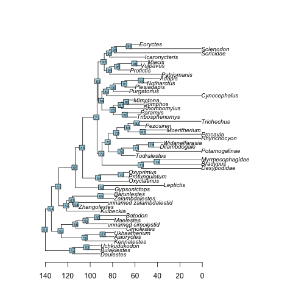

Of course you can use your own data as detailed in the [previous chapter](#What-sort-of-data-does-dispRity-work-with).

### Disparity through time

The `dispRity.through.time` function calculates disparity through time, a common analysis in palaeontology.
This function (and the following one) uses an analysis pipeline with a lot of default parameters to make the analysis as simple as possible. 
Of course all the defaults can be changed if required, more on this later.

For a disparity through time analysis, you will need:
  
  * An ordinated matrix (we covered that above)
  * A phylogenetic tree: this must be a `phylo` object (from the `ape` package) and needs a `root.time` element. To give your tree a root time (i.e. an age for the root), you can simply do\\ `my_tree$root.time <- my_age`.
  * The required number of time subsets (here `time = 3`)
  * Your favourite disparity metric (here the sum of variances)

Using the Beck and Lee (2014) data described [above](#example-data):


```r
## Measuring disparity through time
disparity_data <- dispRity.through.time(BeckLee_mat50, BeckLee_tree,
                                        time = 3, metric = c(sum, variances))
```

This generates a `dispRity` object (see [here](#guts) for technical details).
When displayed, these `dispRity` objects provide us with information on the operations done to the matrix:


```r
## Print the disparity_data object
disparity_data
```

```
##  ---- dispRity object ---- 
## 3 discrete time subsets for 50 elements with 48 dimensions:
##     133.51104 - 89.00736, 89.00736 - 44.50368, 44.50368 - 0.
## Data was bootstrapped 100 times (method:"full").
## Disparity was calculated as: metric.
```

We asked for three subsets (evenly spread across the age of the tree), the data was bootstrapped 100 times (default) and the metric used was the sum of variances.

We can now summarise or plot the `disparity_data` object, or perform statistical tests on it (e.g. a simple `lm`): 


```r
## Summarising disparity through time
summary(disparity_data)
```

```
##                subsets  n   obs bs.median  2.5%   25%   75% 97.5%
## 1 133.51104 - 89.00736  5 1.575     1.305 0.729 1.118 1.420 1.509
## 2  89.00736 - 44.50368 29 1.922     1.867 1.775 1.830 1.889 1.922
## 3         44.50368 - 0 16 1.990     1.871 1.716 1.831 1.914 1.942
```

```r
## Plotting the results
plot(disparity_data, type = "continuous")
```

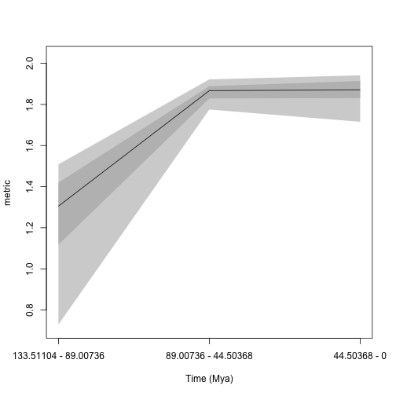

```r
## Testing for an difference among the time bins
disp_lm <- test.dispRity(disparity_data, test = lm, comparisons = "all")
summary(disp_lm)
```

```
## 
## Call:
## test(formula = data ~ subsets, data = data)
## 
## Residuals:
##      Min       1Q   Median       3Q      Max 
## -0.56623 -0.04160  0.01049  0.05507  0.31886 
## 
## Coefficients:
##                            Estimate Std. Error t value Pr(>|t|)    
## (Intercept)                 1.25647    0.01270   98.97   <2e-16 ***
## subsets44.50368 - 0         0.60863    0.01795   33.90   <2e-16 ***
## subsets89.00736 - 44.50368  0.60169    0.01795   33.51   <2e-16 ***
## ---
## Signif. codes:  0 '***' 0.001 '**' 0.01 '*' 0.05 '.' 0.1 ' ' 1
## 
## Residual standard error: 0.127 on 297 degrees of freedom
## Multiple R-squared:  0.8361,	Adjusted R-squared:  0.835 
## F-statistic: 757.5 on 2 and 297 DF,  p-value: < 2.2e-16
```

Please refer to the [specific tutorials](#specific-tutorial) for (much!) more information on the nuts and bolts of the package.
You can also directly explore the specific function help files within R and navigate to related functions.

### Disparity among groups

The `dispRity.per.group` function is used if you are interested in looking at disparity among groups rather than through time.
For example, you could ask if there is a difference in disparity between two groups?

To perform such an analysis, you will need:
 
 * An matrix with rows as elements and columns as dimensions (always!)
 * A list of group members: this list should be a list of numeric vectors or names corresponding to the row names in the matrix. For example `list("a" = c(1,2), "b" = c(3,4))` will create a group _a_ containing elements 1 and 2 from the matrix and a group _b_ containing elements 3 and 4. Note that elements can be present in multiple groups at once.
 * Your favourite disparity metric (here the sum of variances)

Using the @beckancient2014 data described [above](#example-data):


```r
## Creating the two groups (crown versus stem) as a list
mammal_groups <- crown.stem(BeckLee_tree, inc.nodes = FALSE)

## Measuring disparity for each group
disparity_data <- dispRity.per.group(BeckLee_mat50, group = mammal_groups,
                                     metric = c(sum, variances))
```

We can display the disparity of both groups by simply looking at the output variable (`disparity_data`) and then summarising the `disparity_data` object and plotting it, and/or by performing a statistical test to compare disparity across the groups (here a Wilcoxon test).


```r
## Print the disparity_data object
disparity_data
```

```
##  ---- dispRity object ---- 
## 2 customised subsets for 50 elements with 48 dimensions:
##     crown, stem.
## Data was bootstrapped 100 times (method:"full").
## Disparity was calculated as: metric.
```

```r
## Summarising disparity in the different groups
summary(disparity_data)
```

```
##   subsets  n   obs bs.median  2.5%   25%   75% 97.5%
## 1   crown 30 1.995     1.933 1.883 1.917 1.951 1.983
## 2    stem 20 1.715     1.635 1.535 1.610 1.664 1.691
```

```r
## Plotting the results
plot(disparity_data)
```

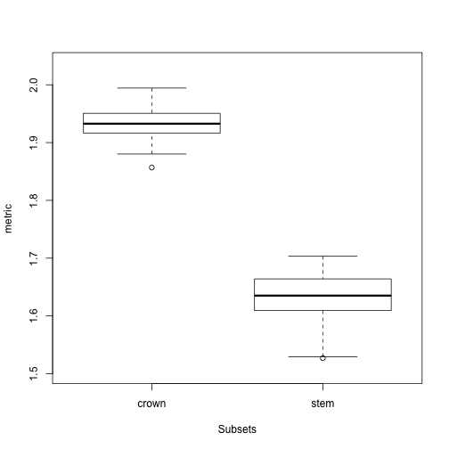

```r
## Testing for a difference between the groups
test.dispRity(disparity_data, test = wilcox.test, details = TRUE)
```

```
## $`crown : stem`
## $`crown : stem`[[1]]
## 
## 	Wilcoxon rank sum test with continuity correction
## 
## data:  dots[[1L]][[1L]] and dots[[2L]][[1L]]
## W = 10000, p-value < 2.2e-16
## alternative hypothesis: true location shift is not equal to 0
```

<!--chapter:end:02_getting-started.Rmd-->

---
title: "Details of specific functions"
author: "Thomas Guillerme (guillert@tcd.ie), Mark Puttick (marknputtick@gmail.com) and  Natalie Cooper (natalie.cooper@nhm.ac.uk)"
date: "2019-03-06"
bibliography: [../References.bib, ../packages.bib]
output:
  html_document: default
  pdf_document: default
---


# Details of specific functions

The following section contains information specific to some functions.
If any of your questions are not covered in these sections, please refer to the function help files in R, send me an email (<guillert@tcd.ie>), or raise an issue on GitHub.
The several tutorials below describe specific functionalities of certain functions; please always refer to the function help files for the full function documentation!

Before each section, make sure you loaded the @beckancient2014 data (see [example data](#example-data) for more details).


```r
## Loading the data
data(BeckLee_mat50)
data(BeckLee_mat99)
data(BeckLee_tree)
data(BeckLee_ages)
```


## Time slicing

The function `chrono.subsets` allows users to divide the matrix into different time subsets or slices given a dated phylogeny that contains all the elements (i.e. taxa) from the matrix.
Each subset generated by this function will then contain all the elements present at a specific point in time or during a specific period in time.

Two types of time subsets can be performed by using the `method` option:

 *  Discrete time subsets (or time-binning) using `method = discrete`
 *  Continuous time subsets (or time-slicing) using `method = continuous`

For the time-slicing method details see @time-slice.
For both methods, the function takes the `time` argument which can be a vector of `numeric` values for:

 *  Defining the boundaries of the time bins (when `method = discrete`)
 *  Defining the time slices (when `method = continuous`)

Otherwise, the `time` argument can be set as a single `numeric` value for automatically generating a given number of equidistant time-bins/slices.
Additionally, it is also possible to input a dataframe containing the first and last occurrence data (FAD/LAD) for taxa that span over a longer time than the given tips/nodes age, so taxa can appear in more than one time bin/slice.

Here is an example for `method = discrete`:


```r
## Generating three time bins containing the taxa present every 40 Ma
chrono.subsets(data = BeckLee_mat50, tree = BeckLee_tree, method = "discrete",
                time = c(120, 80, 40, 0))
```

```
##  ---- dispRity object ---- 
## 3 discrete time subsets for 50 elements:
##     120 - 80, 80 - 40, 40 - 0.
```

Note that we can also generate equivalent results by just telling the function that we want three time-bins as follow:


```r
## Automatically generate three equal length bins:
chrono.subsets(data = BeckLee_mat50, tree = BeckLee_tree, method = "discrete",
                time = 3)
```

```
##  ---- dispRity object ---- 
## 3 discrete time subsets for 50 elements:
##     133.51104 - 89.00736, 89.00736 - 44.50368, 44.50368 - 0.
```

In this example, the taxa were split inside each time-bin according to their age.
However, the taxa here are considered as single points in time.
It is totally possible that some taxa could have had longer longevity and that they exist in multiple time bins.
In this case, it is possible to include them in more than one bin by providing a table of first and last occurrence dates (FAD/LAD).
This table should have the taxa names as row names and two columns for respectively the first and last occurrence age:


```r
## Displaying the table of first and last occurrence dates for each taxa
head(BeckLee_ages)
```

```
##             FAD  LAD
## Adapis     37.2 36.8
## Asioryctes 83.6 72.1
## Leptictis  33.9 33.3
## Miacis     49.0 46.7
## Mimotona   61.6 59.2
## Notharctus 50.2 47.0
```

```r
## Generating time bins including taxa that might span between them
chrono.subsets(data = BeckLee_mat50, tree = BeckLee_tree, method = "discrete",
                time = c(120, 80, 40, 0), FADLAD = BeckLee_ages)
```

```
##  ---- dispRity object ---- 
## 3 discrete time subsets for 50 elements:
##     120 - 80, 80 - 40, 40 - 0.
```

When using this method, the oldest boundary of the first bin (or the first slice, see below) is automatically generated as the root age plus 1\% of the tree length, as long as at least three elements/taxa are present at that point in time.
The algorithm adds an extra 1\% tree length until reaching the required minimum of three elements.
It is also possible to include nodes in each bin by using `inc.nodes = TRUE` and providing a matrix that contains the ordinated distance among tips *and* nodes.

For the time-slicing method (`method = continuous`), the idea is fairly similar.
This option, however, requires a matrix that contains the ordinated distance among taxa *and* nodes and an extra argument describing the assumed evolutionary model (via the `model` argument).
This model argument is used when the time slice occurs along a branch of the tree rather than on a tip or a node, meaning that a decision must be made about what the value for the branch should be.
The model can be one of the following:

 * **Punctuated models**
   *  `acctran` where the data chosen along the branch is always the one of the descendant
   *  `deltran` where the data chosen along the branch is always the one of the ancestor
   *  `random` where the data chosen along the branch is randomly chosen between the descendant or the ancestor
   *  `proximity` where the data chosen along the branch is either the descendant or the ancestor depending on branch length

 * **Gradual models**
   *  `equal.split` where the data chosen along the branch is both the descendant and the ancestor with an even probability
   *  `gradual.split` where the data chosen along the branch is both the descendant and the ancestor with a probability depending on branch length

> Note that the four first models are a proxy for punctuated evolution: the selected data is always either the one of the descendant or the ancestor.
In other words, changes along the branches always occur at either ends of it.
The two last models are a proxy for gradual evolution: the data from both the descendant and the ancestor is used with an associate probability.
These later models perform better when bootstrapped, effectively approximating the "intermediate" state between and the ancestor and the descendants.


```r
## Generating four time slices every 40 million years under a model of proximity evolution
chrono.subsets(data = BeckLee_mat99, tree = BeckLee_tree, 
    method = "continuous", model = "proximity", time = c(120, 80, 40, 0),
    FADLAD = BeckLee_ages)
```

```
##  ---- dispRity object ---- 
## 4 continuous (proximity) time subsets for 99 elements:
##     120, 80, 40, 0.
```

```r
## Generating four time slices automatically
chrono.subsets(data = BeckLee_mat99, tree = BeckLee_tree,
    method = "continuous", model = "proximity", time = 4, FADLAD = BeckLee_ages)
```

```
##  ---- dispRity object ---- 
## 4 continuous (proximity) time subsets for 99 elements:
##     133.51104, 89.00736, 44.50368, 0.
```

If you want to generate time subsets based on stratigraphy, the package proposes a useful functions to do it for you: `get.bin.ages` (check out the function's manual in `R`)!

## Customised subsets

Another way of separating elements into different categories is to use customised subsets as briefly explained [above](#disparity-among-groups).
This function simply takes the list of elements to put in each group (whether they are the actual element names or their position in the matrix).


```r
## Creating the two groups (crown and stems)
mammal_groups <- crown.stem(BeckLee_tree, inc.nodes = FALSE)

## Separating the dataset into two different groups
custom.subsets(BeckLee_mat50, group = mammal_groups)
```

```
##  ---- dispRity object ---- 
## 2 customised subsets for 50 elements:
##     crown, stem.
```

Like in this example, you can use the utility function `crown.stem` that allows to automatically separate the crown and stems taxa given a phylogenetic tree.
Also, elements can easily be assigned to different groups if necessary!


```r
## Creating the three groups as a list
weird_groups <- list("even" = seq(from = 1, to = 49, by = 2),
                      "odd" = seq(from = 2, to = 50, by = 2),
                      "all" = c(1:50))
```

The `custom.subsets` function can also take a phylogeny (as a `phylo` object) as an argument to create groups as clades:


```r
## Creating groups as clades
custom.subsets(BeckLee_mat50, group = BeckLee_tree)
```

This automatically creates 49 (the number of nodes) groups containing between two and 50 (the number of tips) elements.

## Bootstraps and rarefactions

One important step in analysing ordinated matrices is to pseudo-replicate the data to see how robust the results are, and how sensitive they are to outliers in the dataset.
This can be achieved using the function `boot.matrix` to bootstrap and/or rarefy the data.
The default options will bootstrap the matrix 100 times without rarefaction using the "full" bootstrap method (see below):


```r
## Default bootstrapping
boot.matrix(data = BeckLee_mat50)
```

```
##  ---- dispRity object ---- 
## 50 elements with 48 dimensions.
## Data was bootstrapped 100 times (method:"full").
```

The number of bootstrap replicates can be defined using the `bootstraps` option.
The method can be modified by controlling which bootstrap algorithm to use through the `boot.type` argument.
Currently two algorithms are implemented:

 * `full` where the bootstrapping is entirely stochastic (*n* elements are replaced by any *m* elements drawn from the data)
 * `single` where only one random element is replaced by one other random element for each pseudo-replicate


```r
## Bootstrapping with the single bootstrap method
boot.matrix(BeckLee_mat50, boot.type = "single")
```

```
##  ---- dispRity object ---- 
## 50 elements with 48 dimensions.
## Data was bootstrapped 100 times (method:"single").
```

This function also allows users to rarefy the data using the `rarefaction` argument.
Rarefaction allows users to limit the number of elements to be drawn at each bootstrap replication.
This is useful if, for example, one is interested in looking at the effect of reducing the number of elements on the results of an analysis.

This can be achieved by using the `rarefaction` option that draws only *n-x* at each bootstrap replicate (where *x* is the number of elements not sampled).
The default argument is `FALSE` but it can be set to `TRUE` to fully rarefy the data (i.e. remove *x* elements for the number of pseudo-replicates, where *x* varies from the maximum number of elements present in each subset to a minimum of three elements).
It can also be set to one or more `numeric` values to only rarefy to the corresponding number of elements.


```r
## Bootstrapping with the full rarefaction
boot.matrix(BeckLee_mat50, bootstraps = 20, rarefaction = TRUE)
```

```
##  ---- dispRity object ---- 
## 50 elements with 48 dimensions.
## Data was bootstrapped 20 times (method:"full") and fully rarefied.
```

```r
## Or with a set number of rarefaction levels
boot.matrix(BeckLee_mat50, bootstraps = 20, rarefaction = c(6:8, 3))
```

```
##  ---- dispRity object ---- 
## 50 elements with 48 dimensions.
## Data was bootstrapped 20 times (method:"full") and rarefied to 6, 7, 8, 3 elements.
```

One other argument is `dimensions` that specifies how many dimensions from the matrix should be used for further analysis.
When missing, all dimensions from the ordinated matrix are used.


```r
## Using the first 50% of the dimensions
boot.matrix(BeckLee_mat50, dimensions = 0.5)
```

```
##  ---- dispRity object ---- 
## 50 elements with 24 dimensions.
## Data was bootstrapped 100 times (method:"full").
```

```r
## Using the first 10 dimensions
boot.matrix(BeckLee_mat50, dimensions = 10)
```

```
##  ---- dispRity object ---- 
## 50 elements with 10 dimensions.
## Data was bootstrapped 100 times (method:"full").
```

It is also possible to specify the sampling probability in the bootstrap for each elements.
This can be useful for weighting analysis for example (i.e. giving more importance to specific elements).
These probabilities can be passed to the `prob` argument individually with a vector with the elements names or with a matrix with the rownames as elements names.
The elements with no specified probability will be assigned a probability of 1 (or 1/maximum weight if the argument is weights rather than probabilities).


```r
## Attributing a weight of 0 to Cimolestes and 10 to Maelestes
boot.matrix(BeckLee_mat50, prob = c("Cimolestes" = 0, "Maelestes" = 10))
```

```
##  ---- dispRity object ---- 
## 50 elements with 48 dimensions.
## Data was bootstrapped 100 times (method:"full").
```

Of course, one could directly supply the subsets generated above (using `chrono.subsets` or `custom.subsets`) to this function.


```r
## Creating subsets of crown and stem mammals
crown_stem <- custom.subsets(BeckLee_mat50,
                                group = list("crown" = c(16, 19:41, 45:50), 
                                             "stem" = c(1:15, 17:18, 42:44)))
## Bootstrapping and rarefying these groups
boot.matrix(crown_stem, bootstraps = 200, rarefaction = TRUE)
```

```
##  ---- dispRity object ---- 
## 2 customised subsets for 50 elements with 48 dimensions:
##     crown, stem.
## Data was bootstrapped 200 times (method:"full") and fully rarefied.
```

```r
## Creating time slice subsets
time_slices <- chrono.subsets(data = BeckLee_mat99, tree = BeckLee_tree, 
                               method = "continuous", model = "proximity", 
                               time = c(120, 80, 40, 0),
                               FADLAD = BeckLee_ages)

## Bootstrapping the time slice subsets
boot.matrix(time_slices, bootstraps = 100)
```

```
##  ---- dispRity object ---- 
## 4 continuous (proximity) time subsets for 99 elements with 97 dimensions:
##     120, 80, 40, 0.
## Data was bootstrapped 100 times (method:"full").
```

## Disparity metrics

There are many ways of measuring disparity!
In brief, disparity is a summary metric that will represent an aspect of an ordinated space (e.g. a MDS, PCA, PCO, PCoA).
For example, one can look at ellipsoid hyper-volume of the ordinated space (Donohue _et al._ 2013), the sum and the product of the ranges and variances (Wills _et al._ 1994) or the median position of the elements relative to their centroid (Wills _et al._ 1994). 
Of course, there are many more examples of metrics one can use for describing some aspect of the ordinated space, with some performing better than other ones at particular descriptive tasks, and some being more generalist.

Because of this great diversity of metrics, the package `dispRity` does not have one way to measure disparity but rather proposes to facilitate users in defining their own disparity metric that will best suit their particular analysis.
In fact, the core function of the package, `dispRity`, allows the user to define any metric with the `metric` argument.
However the `metric` argument has to follow certain rules:

1.  It must be composed from one to three `function` objects;
2.  The function(s) must take as a first argument a `matrix` or a `vector`;
3.  The function(s) must be of one of the three dimension-levels described below;
4.  At least one of the functions must be of dimension-level 1 or 2 (see below).


### The function dimension-levels

The metric function dimension-levels determine the "dimensionality of decomposition" of the input matrix.
In other words, each dimension-level designates the dimensions of the output, i.e. either three (a `matrix`); two (a `vector`); or one (a single `numeric` value) dimension.


#### Dimension-level 1 functions

A dimension-level 1 function will decompose a `matrix` or a `vector` into a single value:


```r
## Creating a dummy matrix
dummy_matrix <- matrix(rnorm(12), 4, 3)

## Example of dimension-level 1 functions
mean(dummy_matrix)
```

```
## [1] 0.4719271
```

```r
median(dummy_matrix)
```

```
## [1] 0.4816107
```

Any summary metric such as mean or median are good examples of dimension-level 1 functions as they reduce the matrix to a single dimension (i.e. one value).

#### Dimension-level 2 functions

A dimension-level 2 function will decompose a `matrix` into a `vector`.


```r
## Defining the function as the product of rows
prod.rows <- function(matrix) apply(matrix, 1, prod)

## A dimension-level 2 metric
prod.rows(dummy_matrix)
```

```
## [1] -0.1693259  0.1151639  0.4023232  0.2070852
```

Several dimension-level 2 functions are implemented in `dispRity` (see `?dispRity.metric`) such as the `variances` or `ranges` functions that calculate the variance or the range of each dimension of the ordinated matrix respectively.

#### Dimension-level 3 functions

Finally a dimension-level 3 function will transform the matrix into another matrix.
Note that the dimension of the output matrix doesn't need to match the the input matrix:


```r
## A dimension-level 3 metric
var(dummy_matrix)
```

```
##           [,1]      [,2]      [,3]
## [1,] 0.2275789 0.2927228 0.2720648
## [2,] 0.2927228 0.6394468 0.6796798
## [3,] 0.2720648 0.6796798 1.9455929
```

```r
## A dimension-level 3 metric with a forced matrix output
as.matrix(dist(dummy_matrix))
```

```
##          1        2         3         4
## 1 0.000000 2.284299 3.1469895 3.2820238
## 2 2.284299 0.000000 1.8652681 1.9829745
## 3 3.146990 1.865268 0.0000000 0.6684051
## 4 3.282024 1.982975 0.6684051 0.0000000
```

### `make.metric`

Of course, functions can be more complex and involve multiple operations such as the `centroids` function (see `?dispRity.metric`) that calculates the Euclidean distance between each element and the centroid of the ordinated space.
The `make.metric` function implemented in `dispRity` is designed to help test and find the dimension-level of the functions.
This function tests:

1.  If your function can deal with a `matrix` or a `vector` as an input;
2.  Your function's dimension-level according to its output (dimension-level 1, 2 or 3, see above);
3.  Whether the function can be implemented in the `dispRity` function (the function is fed into a `lapply` loop).

For example, let's see if the functions described above are the right dimension-levels:


```r
## Which dimension-level is the mean function? And can it be used in dispRity?
make.metric(mean)
```

```
## mean outputs a single value.
## mean is detected as being a dimension-level 1 function.
```

```r
## Which dimension-level is the prod.rows function? And can it be used in dispRity?
make.metric(prod.rows)
```

```
## prod.rows outputs a matrix object.
## prod.rows is detected as being a dimension-level 2 function.
```

```r
## Which dimension-level is the var function? And can it be used in dispRity?
make.metric(var)
```

```
## var outputs a matrix object.
## var is detected as being a dimension-level 3 function.
## Additional dimension-level 2 and/or 1 function(s) will be needed.
```

A non verbose version of the function is also available.
This can be done using the option `silent = TRUE` and will simply output the dimension-level of the metric.


```r
## Testing whether mean is dimension-level 1
if(make.metric(mean, silent = TRUE) != "level1") {
    message("The metric is not dimension-level 1.")
}
## Testing whether var is dimension-level 1
if(make.metric(var, silent = TRUE) != "level1") {
    message("The metric is not dimension-level 1.")
}
```

```
## The metric is not dimension-level 1.
```

### Metrics in the `dispRity` function

Using this metric structure, we can easily use any disparity metric in the `dispRity` function as follows:


```r
## Measuring disparity as the standard deviation of all the values of the
## ordinated matrix (dimension-level 1 function).
summary(dispRity(BeckLee_mat50, metric = sd))
```

```
##   subsets  n   obs
## 1       1 50 0.201
```

```r
## Measuring disparity as the standard deviation of the variance of each axis of
## the ordinated matrix (dimension-level 1 and 2 functions).
summary(dispRity(BeckLee_mat50, metric = c(sd, variances)))
```

```
##   subsets  n   obs
## 1       1 50 0.028
```

```r
## Measuring disparity as the standard deviation of the variance of each axis of
## the variance covariance matrix (dimension-level 1, 2 and 3 functions).
summary(dispRity(BeckLee_mat50, metric = c(sd, variances, var)), round = 10)
```

```
##   subsets  n obs
## 1       1 50   0
```

Note that the order of each function in the metric argument does not matter, the `dispRity` function will automatically detect the function dimension-levels (using `make.metric`) and apply them to the data in decreasing order (dimension-level 3 > 2 > 1).


```r
## Disparity as the standard deviation of the variance of each axis of the
## variance covariance matrix:
disparity1 <- summary(dispRity(BeckLee_mat50, metric = c(sd, variances, var)),
                      round = 10)

## Same as above but using a different function order for the metric argument
disparity2 <- summary(dispRity(BeckLee_mat50, metric = c(variances, sd, var)),
                      round = 10)

## Both ways output the same disparity values:
disparity1 == disparity2
```

```
##      subsets    n  obs
## [1,]    TRUE TRUE TRUE
```

In these examples, we considered disparity to be a single value.
For example, in the previous example, we defined disparity as the standard deviation of the variances of each column of the variance/covariance matrix (`metric = c(variances, sd, var)`).
It is, however, possible to calculate [disparity as a distribution](#disparity-as-a-distribution).

### Metrics implemented in `dispRity`

Several disparity metrics are implemented in the `dispRity` package.
The detailed list can be found in `?dispRity.metric` along with some description of each metric.

Level | Name | Description | Source | 
------|------|---------------------------------------------------|--------|
2 | `ancestral.dist` | The distance between an element and its ancestor | `dispRity` |
2 | `centroids`<sup>1</sup> | The distance between each element and the centroid of the ordinated space | `dispRity` |
1 | `convhull.surface` | The surface of the convex hull formed by all the elements | [`geometry`](https://cran.r-project.org/web/packages/geometry/index.html)`::convhulln$area` |
1 | `convhull.volume` | The volume of the convex hull formed by all the elements | [`geometry`](https://cran.r-project.org/web/packages/geometry/index.html)`::convhulln$vol` |
1 | `diagonal` | The longest distance in the ordinated space (like the diagonal in two dimensions) | `dispRity` |
1 | `ellipse.volume`<sup>1</sup> | The volume of the ellipsoid of the space | Donohue _et al._ (2013) |
1 | `mode.val` | The modal value | `dispRity` |
1 | `n.ball.volume` | The hyper-spherical (*n*-ball) volume | `dispRity` |
2 | `pairwise.dist` | The pairwise distances between elements | [`vegan`](https://cran.r-project.org/web/packages/vegan/index.html)`::vegist` |
2 | `radius` | The radius of each dimensions | `dispRity` |
2 | `ranges` | The range of each dimension | `dispRity` |
1 | `span.tree.length` | The minimal spanning tree length | [`vegan`](https://cran.r-project.org/web/packages/vegan/index.html)`::spantree` |
2 | `variances` | The variance of each dimension | `dispRity` |

1: Note that by default, the centroid is the centroid of the elements.
It can, however, be fixed to a different value by using the `centroid` argument `centroids(space, centroid = rep(0, ncol(space)))`, for example the origin of the ordinated space.

2: This function uses an estimation of the eigenvalue that only works for MDS or PCoA ordinations (*not* PCA).

### Equations and implementations
Some of the functions described below are implemented in the `dispRity` package and do not require any other packages to calculate ([see implementation here](https://github.com/TGuillerme/dispRity/blob/master/R/dispRity.metric.R)).

\begin{equation}
    ancestral.dist = \sqrt{\sum_{i=1}^{n}{({k}_{n}-Ancestor_{n})^2}}
\end{equation}

\begin{equation}
    centroids = \sqrt{\sum_{i=1}^{n}{({k}_{n}-Centroid_{k})^2}}
\end{equation}

\begin{equation}
    diagonal = \sqrt{\sum_{i=1}^{k}|max(k_i) - min(k_i)|}
\end{equation}

\begin{equation}
    ellipse.volume = \frac{\pi^{k/2}}{\Gamma(\frac{k}{2}+1)}\displaystyle\prod_{i=1}^{k} (\lambda_{i}^{0.5})
\end{equation}

\begin{equation}
    n.ball.volume = \frac{\pi^{k/2}}{\Gamma(\frac{k}{2}+1)}\displaystyle\prod_{i=1}^{k} R
\end{equation}

\begin{equation}
    radius = |\frac{\sum_{i=1}^{n}k_i}{n} - f(\mathbf{v}k)|
\end{equation}

\begin{equation}
    ranges = |max(k_i) - min(k_i)|
\end{equation}

\begin{equation}
    variances = \sigma^{2}{k_i}
\end{equation}

\begin{equation}
    span.tree.length = \sum(\mathrm{branch\ length})
\end{equation}


Where *k* is the number of dimensions,
*n* the number of elements,
$\Gamma$ is the Gamma distribution,
$\lambda_i$ is the eigenvalue of each dimensions,
$\sigma^{2}$ is their variance and
$Centroid_{k}$ is their mean,
$Ancestor_{n}$ is the coordinates of the ancestor of element $n$,
$f(\mathbf{v}k)$ is function to select one value from the vector $\mathbf{v}$ of the dimension $k$ (e.g. it's maximum, minimum, mean, etc.),
*R* is the radius of the sphere or the product of the radii of each dimensions ($\displaystyle\prod_{i=1}^{k}R_{i}$ - for a hyper-ellipsoid).

### Using the different disparity metrics
Here is a brief demonstration of the main metrics implemented in `dispRity`.
First, we will create a dummy/simulated ordinated space using the `space.maker` utility function (more about that [here](#space.maker):


```r
## Creating a 10*5 normal space
set.seed(1)
dummy_space <- space.maker(10, 5, rnorm)
```

We will use this simulated space to demonstrate the different metrics.

#### Volumes and surface metrics
The functions `ellipse.volume`, `convhull.surface`, `convhull.volume` and `n.ball.volume`  all measure the surface or the volume of the ordinated space occupied:

Because there is only one subset (i.e. one matrix) in the dispRity object, the operations below are the equivalent of `metric(dummy_space)` (with rounding).


```r
## Calculating the ellipsoid volume
summary(dispRity(dummy_space, metric = ellipse.volume))
```

```
##   subsets  n   obs
## 1       1 10 1.061
```
> WARNING: in such dummy space, this gives the estimation of the ellipsoid volume, not the real ellipsoid volume! See the cautionary note in `?ellipse.volume`.


```r
## Calculating the convex hull surface
summary(dispRity(dummy_space, metric = convhull.surface))
```

```
##   subsets  n   obs
## 1       1 10 11.91
```

```r
## Calculating the convex hull volume
summary(dispRity(dummy_space, metric = convhull.volume))
```

```
##   subsets  n   obs
## 1       1 10 1.031
```

```r
## Calculating the convex hull volume
summary(dispRity(dummy_space, metric = n.ball.volume))
```

```
##   subsets  n  obs
## 1       1 10 4.43
```

The convex hull based functions are a call to the `geometry::convhulln` function with the `"FA"` option (computes total area and volume).
Also note that they are really sensitive to the size of the dataset.

> Cautionary note: measuring volumes in a high number of dimensions can be strongly affected by the [curse of dimensionality](https://en.wikipedia.org/wiki/Curse_of_dimensionality) that often results in near 0 disparity values. I strongly recommend reading [this really intuitive explanation](https://beta.observablehq.com/@tophtucker/theres-plenty-of-room-in-the-corners) from [Toph Tucker](https://github.com/tophtucker).

#### Ranges, variances, radius, pairwise distance, modal value and diagonal

The functions `ranges`, `variances` `radius`, `pairwise.dist`, `mode.val` and `diagonal` all measure properties of the ordinated space based on its dimensional properties (they are also less affected by the "curse of dimensionality"):

`ranges`, `variances` and `radius` work on the same principle and measure the range/variance/radius of each dimension:


```r
## Calculating the ranges of each dimension in the ordinated space
ranges(dummy_space)
```

```
## [1] 2.430909 3.726481 2.908329 2.735739 1.588603
```

```r
## Calculating disparity as the distribution of these ranges
summary(dispRity(dummy_space, metric = ranges))
```

```
##   subsets  n obs.median  2.5%   25%   75% 97.5%
## 1       1 10      2.736 1.673 2.431 2.908 3.645
```

```r
## Calculating disparity as the sum and the product of these ranges
summary(dispRity(dummy_space, metric = c(sum, ranges)))
```

```
##   subsets  n   obs
## 1       1 10 13.39
```

```r
summary(dispRity(dummy_space, metric = c(prod, ranges)))
```

```
##   subsets  n   obs
## 1       1 10 114.5
```

```r
## Calculating the variances of each dimension in the ordinated space
variances(dummy_space)
```

```
## [1] 0.6093144 1.1438620 0.9131859 0.6537768 0.3549372
```

```r
## Calculating disparity as the distribution of these variances
summary(dispRity(dummy_space, metric = variances))
```

```
##   subsets  n obs.median 2.5%   25%   75% 97.5%
## 1       1 10      0.654 0.38 0.609 0.913 1.121
```

```r
## Calculating disparity as the sum and the product of these variances
summary(dispRity(dummy_space, metric = c(sum, variances)))
```

```
##   subsets  n   obs
## 1       1 10 3.675
```

```r
summary(dispRity(dummy_space, metric = c(prod, variances)))
```

```
##   subsets  n   obs
## 1       1 10 0.148
```

```r
## Calculating the radius of each dimension in the ordinated space
radius(dummy_space)
```

```
## [1] 1.4630780 2.4635449 1.8556785 1.4977898 0.8416318
```

```r
## By default the radius is the maximum distance from the centre of
## the dimension. It can however be changed to any function:
radius(dummy_space, type = min)
```

```
## [1] 0.05144054 0.14099827 0.02212226 0.17453525 0.23044528
```

```r
radius(dummy_space, type = mean)
```

```
## [1] 0.6233501 0.7784888 0.7118713 0.6253263 0.5194332
```

```r
## Calculating disparity as the mean average radius
summary(dispRity(dummy_space, metric = c(mean, radius), type = mean))
```

```
##   subsets  n   obs
## 1       1 10 0.652
```

The pairwise distances uses the function `vegan::vegdist` and can take the normal `vegdist` options:


```r
## The average pairwise euclidean distance
summary(dispRity(dummy_space, metric = c(mean, pairwise.dist)))
```

```
##   subsets  n   obs
## 1       1 10 2.539
```

```r
## The distribution of the Manhattan distances
summary(dispRity(dummy_space, metric = pairwise.dist, method = "manhattan"))
```

```
##   subsets  n obs.median  2.5%   25%   75% 97.5%
## 1       1 10      4.427 2.566 3.335 5.672  9.63
```

Note that this function is a direct call to `vegan::vegdist(matrix, method = method, diag = FALSE, upper = FALSE, ...)`.

The `diagonal` function measures the multidimensional diagonal of the whole space (i.e. in our case the longest Euclidean distance in our five dimensional space).
The `mode.val` function measures the modal value of the matrix:


```r
## Calculating the ordinated space's diagonal
summary(dispRity(dummy_space, metric = diagonal))
```

```
##   subsets  n   obs
## 1       1 10 3.659
```

```r
## Calculating the modal value of the matrix
summary(dispRity(dummy_space, metric = mode.val))
```

```
##   subsets  n   obs
## 1       1 10 -2.21
```

> This metric is only a Euclidean diagonal (mathematically valid) if the dimensions within the space are all orthogonal!

#### Centroids and ancestral distance metrics

The `centroids` metric allows users to measure the position of the different elements compared to a fixed point in the ordinated space.
By default, this function measures the distance between each element and their centroid (centre point):


```r
## The distribution of the distances between each element and their centroid
summary(dispRity(dummy_space, metric = centroids))
```

```
##   subsets  n obs.median  2.5%   25%   75% 97.5%
## 1       1 10      1.435 0.788 1.267 1.993 3.167
```

```r
## Disparity as the median value of these distances
summary(dispRity(dummy_space, metric = c(median, centroids)))
```

```
##   subsets  n   obs
## 1       1 10 1.435
```

It is however possible to fix the coordinates of the centroid to a specific point in the ordinated space, as long as it has the correct number of dimensions:


```r
## The distance between each element and the origin of the ordinated space
summary(dispRity(dummy_space, metric = centroids, centroid = c(0,0,0,0,0)))
```

```
##   subsets  n obs.median  2.5% 25%   75% 97.5%
## 1       1 10      1.487 0.785 1.2 2.044 3.176
```

```r
## Disparity as the distance between each element and a specific point in space
summary(dispRity(dummy_space, metric = centroids, centroid = c(0,1,2,3,4)))
```

```
##   subsets  n obs.median  2.5%   25%   75% 97.5%
## 1       1 10      5.489 4.293 5.032 6.155 6.957
```

The `ancestral.dist` metric works on a similar principle as the `centroids` function but changes the centroid to be the coordinates of each element's ancestor.
Therefore this functions needs a tree and node coordinates as additional arguments:


```r
## A generating a random tree with node labels
tree <- rtree(5) ; tree$node.label <- paste0("n", 1:4)
## Adding the tip and node names to the matrix
dummy_space2 <- dummy_space[-1,]
rownames(dummy_space2) <- c(tree$tip.label, tree$node.label)

## Calculating all the ancestral nodes
all_anc_centroids <- nodes.coordinates(dummy_space2, tree, full = TRUE)

## Calculating the distances from the ancestral nodes
ancestral_dist <- dispRity(dummy_space2, metric = ancestral.dist,
                           nodes.coords = all_anc_centroids)

## The ancestral distances distributions
summary(ancestral_dist)
```

```
##   subsets n obs.median  2.5%   25%   75% 97.5%
## 1       1 9      3.862 0.343 1.729 4.789  9.52
```

```r
## Calculating disparity as the sum of the distances from all the ancestral nodes
summary(dispRity(ancestral_dist, metric = sum))
```

```
##   subsets n   obs
## 1       1 9 36.56
```

#### Minimal spanning tree length

The `span.tree.length` uses the `vegan::spantree` function to heuristically calculate the minimum spanning tree (the shortest multidimensional tree connecting each elements) and calculates its length as the sum of every branch lengths.


```r
## The length of the minimal spanning tree
summary(dispRity(dummy_space, metric = span.tree.length))
```

```
##   subsets  n  obs
## 1       1 10 15.4
```

Note that because the solution is heuristic, this metric can take a long time to compute for big matrices.

## Summarising dispRity data (plots)

Because of its architecture, printing `dispRity` objects only summarises their content but does not print the disparity value measured or associated analysis (more about this [here](#manipulating-dispRity-objects)).
To actually see what is in a dispRity object, one can either use the `summary` function for visualising the data in a table or `plot` to have a graphical representation of the results.

### Summarising `dispRity` data
This function is an S3 function (`summary.dispRity`) allowing users to summarise the content of `dispRity` objects that contain disparity calculations.


```r
## Example data from previous sections
crown_stem <- custom.subsets(BeckLee_mat50,
                                group = list("crown" = c(16, 19:41, 45:50), 
                                             "stem" = c(1:15, 17:18, 42:44)))
## Bootstrapping and rarefying these groups
boot_crown_stem <- boot.matrix(crown_stem, bootstraps = 100, rarefaction = TRUE)
## Calculate disparity
disparity_crown_stem <- dispRity(boot_crown_stem, metric = c(sum, variances))

## Creating time slice subsets
time_slices <- chrono.subsets(data = BeckLee_mat99, tree = BeckLee_tree, 
    method = "continuous", model = "proximity", time = c(120, 80, 40, 0),
    FADLAD = BeckLee_ages)
## Bootstrapping the time slice subsets
boot_time_slices <- boot.matrix(time_slices, bootstraps = 100)
## Calculate disparity
disparity_time_slices <- dispRity(boot_time_slices, metric = c(sum, variances))

## Creating time bin subsets
time_bins <- chrono.subsets(data = BeckLee_mat99, tree = BeckLee_tree, 
    method = "discrete", time = c(120, 80, 40, 0), FADLAD = BeckLee_ages,
    inc.nodes = TRUE)
## Bootstrapping the time bin subsets
boot_time_bins <- boot.matrix(time_bins, bootstraps = 100)
## Calculate disparity
disparity_time_bins <- dispRity(boot_time_bins, metric = c(sum, variances))
```

These objects are easy to summarise as follows:


```r
## Default summary
summary(disparity_time_slices)
```

```
##   subsets  n   obs bs.median  2.5%   25%   75% 97.5%
## 1     120  5 2.823     2.297 1.263 2.119 2.579 2.767
## 2      80 19 3.233     3.060 2.815 2.986 3.126 3.212
## 3      40 15 3.359     3.139 2.660 3.045 3.250 3.433
## 4       0 10 4.055     3.692 3.169 3.459 3.768 3.961
```

Information about the number of elements in each subset and the observed (i.e. non-bootstrapped) disparity are also calculated.
This is specifically handy when rarefying the data for example:


```r
head(summary(disparity_crown_stem))
```

```
##   subsets  n   obs bs.median  2.5%   25%   75% 97.5%
## 1   crown 30 1.995     1.931 1.878 1.914 1.947 1.968
## 2   crown 29    NA     1.931 1.861 1.908 1.951 1.976
## 3   crown 28    NA     1.931 1.862 1.907 1.951 1.973
## 4   crown 27    NA     1.935 1.849 1.909 1.951 1.970
## 5   crown 26    NA     1.930 1.861 1.905 1.950 1.976
## 6   crown 25    NA     1.929 1.847 1.914 1.949 1.975
```

The summary functions can also take various options such as:

 * `quantile` values for the confidence interval levels (by default, the 50 and 95 quantiles are calculated)
 * `cent.tend` for the central tendency to use for summarising the results (default is `median`)
 * digits` option corresponding to the number of decimal places to print (default is `2`)
 * `recall` option for printing the call of the `dispRity` object as well (default is `FALSE`)

These options can easily be changed from the defaults as follows:


```r
## Same as above but using the 88th quantile and the standard deviation as the summary 
summary(disparity_time_slices, quantile = 88, cent.tend = sd)
```

```
##   subsets  n   obs bs.sd  2.5%   25%   75% 97.5%
## 1     120  5 2.823 0.387 1.263 2.119 2.579 2.767
## 2      80 19 3.233 0.105 2.815 2.986 3.126 3.212
## 3      40 15 3.359 0.174 2.660 3.045 3.250 3.433
## 4       0 10 4.055 0.205 3.169 3.459 3.768 3.961
```

```r
## Printing the details of the object and digits the values to the 5th decimal place
summary(disparity_time_slices, recall = TRUE, digits = 5)
```

```
##  ---- dispRity object ---- 
## 4 continuous (proximity) time subsets for 99 elements with 97 dimensions:
##     120, 80, 40, 0.
## Data was bootstrapped 100 times (method:"full").
## Disparity was calculated as: c(sum, variances).
```

```
##   subsets  n     obs bs.median    2.5%     25%     75%   97.5%
## 1     120  5 2.82292   2.29655 1.26271 2.11928 2.57865 2.76690
## 2      80 19 3.23312   3.05983 2.81513 2.98594 3.12552 3.21213
## 3      40 15 3.35947   3.13894 2.65991 3.04502 3.24950 3.43262
## 4       0 10 4.05457   3.69167 3.16864 3.45865 3.76807 3.96114
```

Note that the summary table is a `data.frame`, hence it is as easy to modify as any dataframe using `dplyr`.
You can also export it in `csv` format using `write.csv` or `write_csv` or even directly export into `LaTeX` format using the following;


```r
## Loading the xtable package
require(xtable)
## Converting the table in LaTeX
xtable(summary(disparity_time_slices))
```

### Plotting `dispRity` data
An alternative (and more fun!) way to display the calculated disparity is to plot the results using the S3 method `plot.dispRity`.
This function takes the same options as `summary.dispRity` along with various graphical options described in the function help files (see `?plot.dispRity`).

The plots can be of four different types:
 
 * `continuous` for displaying continuous disparity curves
 * `box`, `lines`, and `polygons` to display discrete disparity results in respectively a boxplot, confidence interval lines, and confidence interval polygons.

> This argument can be left empty. In this case, the algorithm will automatically detect the type of subsets from the `dispRity` object and plot accordingly.

It is also possible to display the number of elements in each subset (as a horizontal dotted line) using the option `elements = TRUE`.
Additionally, when the data is rarefied, one can indicate which level of rarefaction to display (i.e. only display the results for a certain number of elements) by using the `rarefaction` argument.


```r
## Graphical parameters
op <- par(mfrow = c(2, 2), bty = "n")

## Plotting continuous disparity results
plot(disparity_time_slices, type = "continuous")

## Plotting discrete disparity results
plot(disparity_crown_stem, type = "box")

## As above but using lines for the rarefaction level of 20 elements only
plot(disparity_crown_stem, type = "line", rarefaction = 20)

## As above but using polygons while also displaying the number of elements
plot(disparity_crown_stem, type = "polygon", elements = TRUE)
```

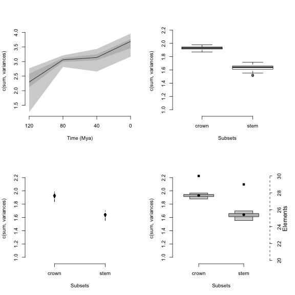

```r
## Resetting graphical parameters
par(op)
```

Since `plot.dispRity` uses the arguments from the generic `plot` method, it is of course possible to change pretty much everything using the regular plot arguments:


```r
## Graphical options
op <- par(bty = "n")

## Plotting the results with some classic options from plot
plot(disparity_time_slices, col = c("blue", "orange", "green"),
    ylab = c("Some measurement"), xlab = "Some other measurement",
    main = "Many options...", ylim = c(5, 0), xlim = c(4, 0))

## Adding a legend
legend("topleft", legend = c("Central tendency",
                             "Confidence interval 1",
                            "Confidence interval 2"),
      col = c("blue", "orange", "green"), pch = 19)
```

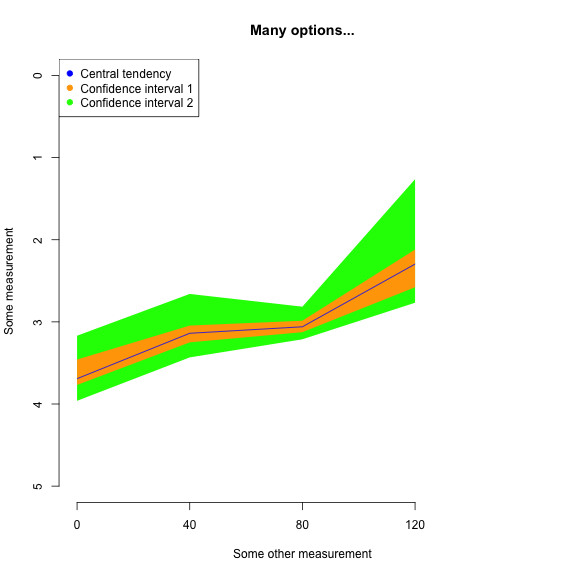

```r
## Resetting graphical parameters
par(op)
```

In addition to the classic `plot` arguments, the function can also take arguments that are specific to `plot.dispRity` like adding the number of elements or rarefaction level (as described above), and also changing the values of the quantiles to plot as well as the central tendency.


```r
## Graphical options
op <- par(bty = "n")

## Plotting the results with some plot.dispRity arguments
plot(disparity_time_slices, quantile = c(seq(from = 10, to = 100, by = 10)),
    cent.tend = sd, type = "c", elements = TRUE, col = c("black", rainbow(10)),
    ylab = c("Disparity", "Diversity"), chrono.subsets = FALSE,
    xlab = "Time (in in units from past to present)", observed = TRUE,
    main = "Many more options...")
```

```
## Warning in plot.window(...): "quantile" is not a graphical parameter
```

```
## Warning in plot.xy(xy, type, ...): "quantile" is not a graphical parameter
```

```
## Warning in axis(side = side, at = at, labels = labels, ...): "quantile" is
## not a graphical parameter

## Warning in axis(side = side, at = at, labels = labels, ...): "quantile" is
## not a graphical parameter
```

```
## Warning in box(...): "quantile" is not a graphical parameter
```

```
## Warning in title(...): "quantile" is not a graphical parameter
```

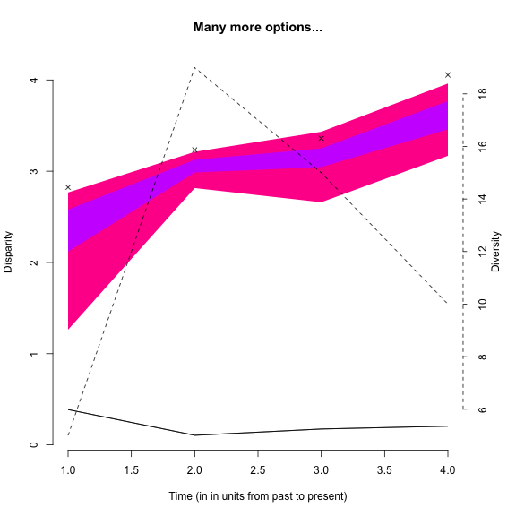

```r
## Resetting graphical parameters
par(op)
```

> Note that the argument `observed = TRUE` allows to plot the disparity values calculated from the non-bootstrapped data as crosses on the plot.

For comparing results, it is also possible to add a plot to the existent plot by using `add = TRUE`:


```r
## Graphical options
op <- par(bty = "n")

## Plotting the continuous disparity with a fixed y axis
plot(disparity_time_slices, ylim = c(1, 4))
## Adding the discrete data
plot(disparity_time_bins, type = "line", ylim = c(1, 4), xlab = "", ylab = "",
    add = TRUE)
```

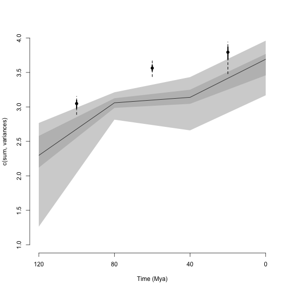

```r
## Resetting graphical parameters
par(op)
```

Finally, if your data has been fully rarefied, it is also possible to easily look at rarefaction curves by using the `rarefaction = TRUE` argument:


```r
## Graphical options
op <- par(bty = "n")

## Plotting the rarefaction curves
plot(disparity_crown_stem, rarefaction = TRUE)
```

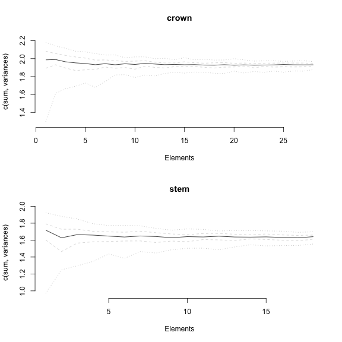

```r
## Resetting graphical parameters
par(op)
```

## Testing disparity hypotheses

The `dispRity` package allows users to apply statistical tests to the calculated disparity to test various hypotheses.
The function `test.dispRity` works in a similar way to the `dispRity` function: it takes a `dispRity` object, a `test` and a `comparisons` argument.

The `comparisons` argument indicates the way the test should be applied to the data:

 * `pairwise` (default): to compare each subset in a pairwise manner
 * `referential`: to compare each subset to the first subset
 * `sequential`: to compare each subset to the following subset
 * `all`: to compare all the subsets together (like in analysis of variance)

It is also possible to input a list of pairs of `numeric` values or `characters` matching the subset names to create personalised tests.
Some other tests implemented in `dispRity` such as the `dispRity::null.test` have a specific way they are applied to the data and therefore ignore the `comparisons` argument. 
<!-- Add sequential test one day! -->

The `test` argument can be any statistical or non-statistical test to apply to the disparity object.
It can be a common statistical test function (e.g. `stats::t.test`), a function implemented in `dispRity` (e.g. see `?null.test`) or any function defined by the user.

This function also allows users to correct for Type I error inflation (false positives) when using multiple comparisons via the `correction` argument. 
This argument can be empty (no correction applied) or can contain one of the corrections from the `stats::p.adjust` function (see `?p.adjust`).

Note that the `test.dispRity` algorithm deals with some classical test outputs and summarises the test output.
It is, however, possible to get the full detailed output by using the options `details = TRUE`.

Here we are using the variables generated in the [section above](#summarising-dispRity-data-plots):


```r
## T-test to test for a difference in disparity between crown and stem mammals
test.dispRity(disparity_crown_stem, test = t.test)
```

```
## [[1]]
##              statistic: t
## crown : stem     63.36853
## 
## [[2]]
##              parameter: df
## crown : stem      160.0496
## 
## [[3]]
##                    p.value
## crown : stem 2.851362e-115
```

```r
## Performing the same test but with the detailed t.test output
test.dispRity(disparity_crown_stem, test = t.test, details = TRUE)
```

```
## $`crown : stem`
## $`crown : stem`[[1]]
## 
## 	Welch Two Sample t-test
## 
## data:  dots[[1L]][[1L]] and dots[[2L]][[1L]]
## t = 63.369, df = 160.05, p-value < 2.2e-16
## alternative hypothesis: true difference in means is not equal to 0
## 95 percent confidence interval:
##  0.2874841 0.3059796
## sample estimates:
## mean of x mean of y 
##  1.929990  1.633258
```

```r
## Wilcoxon test applied to time sliced disparity with sequential comparisons,
## with Bonferroni correction
test.dispRity(disparity_time_slices, test = wilcox.test,
              comparisons = "sequential", correction = "bonferroni")
```

```
## [[1]]
##          statistic: W
## 120 : 80           12
## 80 : 40          3201
## 40 : 0            362
## 
## [[2]]
##               p.value
## 120 : 80 1.097407e-33
## 80 : 40  3.331838e-05
## 40 : 0   2.757591e-29
```

```r
## Measuring the overlap between distributions in the time bins (using the
## implemented Bhattacharyya Coefficient function - see ?bhatt.coeff)
test.dispRity(disparity_time_bins, test = bhatt.coeff)
```

```
## Warning in test.dispRity(disparity_time_bins, test = bhatt.coeff): Multiple p-values will be calculated without adjustment!
## This can inflate Type I error!
```

```
##                    bhatt.coeff
## 120 - 80 : 80 - 40   0.0000000
## 120 - 80 : 40 - 0    0.0000000
## 80 - 40 : 40 - 0     0.5043101
```

Because of the modular design of the package, tests can always be made by the user (the same way disparity metrics can be user made).
The only condition is that the test can be applied to at least two distributions.
In practice, the `test.dispRity` function will pass the calculated disparity data (distributions) to the provided function in either pairs of distributions (if the `comparisons` argument is set to `pairwise`, `referential` or `sequential`) or a table containing all the distributions (`comparisons = all`; this should be in the same format as data passed to `lm`-type functions for example).

### NPMANOVA in `dispRity`

One often useful test to apply to multidimensional data is the permutational multivariate analysis of variance based on distance matrices `vegan::adonis`.
This can be done on `dispRity` objects using the `adonis.dispRity` wrapper function.
Basically, this function takes the exact same arguments as `adonis` and a `dispRity` object for data and performs a PERMANOVA based on the distance matrix of the multidimensional space (unless the multidimensional space was already defined as a distance matrix).
The `adonis.dispRity` function uses the information from the `dispRity` object to generate default formulas:

  * If the object contains customised subsets, it applies the default formula `matrix ~ group` testing the effect of `group` as a predictor on `matrix` (called from the `dispRity` object as `data$matrix` see [`dispRitu` object details](#The-dispRity-object-content))
  * If the object contains time subsets, it applies the default formula `matrix ~ time` testing the effect of `time` as a predictor (were the different levels of `time` are the different time slices/bins)


```r
set.seed(1)
## Generating a random character matrix
character_matrix <- sim.morpho(rtree(20), 50, rates = c(rnorm, 1, 0))

## Calculating the distance matrix
distance_matrix <- as.matrix(dist(character_matrix))

## Creating two groups
random_groups <- list("group1" = 1:10, "group2" = 11:20)

## Generating a dispRity object
random_disparity <- custom.subsets(distance_matrix, random_groups)
```

```
## Warning: custom.subsets is applied on what seems to be a distance matrix.
## The resulting matrices won't be distance matrices anymore!
```

```r
## Running a default NPMANOVA
adonis.dispRity(random_disparity)
```

```
## 
## Call:
## vegan::adonis(formula = matrix ~ group, data = random_disparity,      method = "euclidean") 
## 
## Permutation: free
## Number of permutations: 999
## 
## Terms added sequentially (first to last)
## 
##           Df SumsOfSqs MeanSqs F.Model      R2 Pr(>F)  
## group      1      16.5  16.500  1.3904 0.07171  0.095 .
## Residuals 18     213.6  11.867         0.92829         
## Total     19     230.1                 1.00000         
## ---
## Signif. codes:  0 '***' 0.001 '**' 0.01 '*' 0.05 '.' 0.1 ' ' 1
```

Of course, it is possible to pass customised formulas if the disparity object contains more more groups.
In that case the predictors must correspond to the names of the groups explained data must be set as `matrix`:


```r
## Creating two groups with two states each
groups <- as.data.frame(matrix(data = c(rep(1,10), rep(2,10), rep(c(1,2), 10)),
         nrow = 20, ncol = 2, dimnames = list(paste0("t", 1:20), c("g1", "g2"))))

## Creating the dispRity object
multi_groups <- custom.subsets(distance_matrix, groups)
```

```
## Warning: custom.subsets is applied on what seems to be a distance matrix.
## The resulting matrices won't be distance matrices anymore!
```

```r
## Running the NPMANOVA
adonis.dispRity(multi_groups, matrix ~ g1 + g2)
```

```
## 
## Call:
## vegan::adonis(formula = matrix ~ g1 + g2, data = multi_groups,      method = "euclidean") 
## 
## Permutation: free
## Number of permutations: 999
## 
## Terms added sequentially (first to last)
## 
##           Df SumsOfSqs MeanSqs F.Model      R2 Pr(>F)
## g1         1      16.5  16.500 1.34921 0.07171  0.111
## g2         1       5.7   5.700 0.46609 0.02477  0.998
## Residuals 17     207.9  12.229         0.90352       
## Total     19     230.1                 1.00000
```

Finally, it is possible to use objects generated by `chrono.subsets`.
In this case, `adonis.dispRity` will applied the `matrix ~ time` formula by default:


```r
## Creating time series
time_subsets <- chrono.subsets(BeckLee_mat50, BeckLee_tree, 
     method = "discrete", inc.nodes = FALSE, time = c(100, 85, 65, 0),
     FADLAD = BeckLee_ages)

## Running the NPMANOVA with time as a predictor
adonis.dispRity(time_subsets)
```

```
## Warning in adonis.dispRity(time_subsets): The input data for adonis.dispRity was not a distance matrix.
## The results are thus based on the distance matrix for the input data (i.e. dist(data$matrix)).
## Make sure that this is the desired methodological approach!
```

```
## 
## Call:
## vegan::adonis(formula = dist(matrix) ~ time, data = time_subsets,      method = "euclidean") 
## 
## Permutation: free
## Number of permutations: 999
## 
## Terms added sequentially (first to last)
## 
##           Df SumsOfSqs MeanSqs F.Model      R2 Pr(>F)    
## time       2     8.049  4.0245  2.1303 0.08311  0.001 ***
## Residuals 47    88.792  1.8892         0.91689           
## Total     49    96.841                 1.00000           
## ---
## Signif. codes:  0 '***' 0.001 '**' 0.01 '*' 0.05 '.' 0.1 ' ' 1
```

Note that the function warns you that the input data was transformed into a distance matrix.
This is reflected in the Call part of the output (`formula = dist(matrix) ~ time`).

To use each time subset as a separate predictor, you can use the `matrix ~ chrono.subsets` formula; this is equivalent to `matrix ~ first_time_subset + second_time_subset + ...`:


```r
## Running the NPMANOVA with each time bin as a predictor
adonis.dispRity(time_subsets, matrix ~ chrono.subsets)
```

```
## Warning in adonis.dispRity(time_subsets, matrix ~ chrono.subsets): The input data for adonis.dispRity was not a distance matrix.
## The results are thus based on the distance matrix for the input data (i.e. dist(data$matrix)).
## Make sure that this is the desired methodological approach!
```

```
## 
## Call:
## vegan::adonis(formula = dist(matrix) ~ chrono.subsets, data = time_subsets,      method = "euclidean") 
## 
## Permutation: free
## Number of permutations: 999
## 
## Terms added sequentially (first to last)
## 
##           Df SumsOfSqs MeanSqs F.Model      R2 Pr(>F)    
## t100to85   1     3.090  3.0897  1.6354 0.03190  0.002 ** 
## t85to65    1     4.959  4.9593  2.6251 0.05121  0.001 ***
## Residuals 47    88.792  1.8892         0.91689           
## Total     49    96.841                 1.00000           
## ---
## Signif. codes:  0 '***' 0.001 '**' 0.01 '*' 0.05 '.' 0.1 ' ' 1
```

### `geiger::dtt` model fitting in `dispRity`

The `dtt` function from the `geiger` package is also often used to compare a trait's disparity observed in living taxa to the disparity of a simulated trait based on a given phylogeny.
The `dispRity` package proposes a wrapper function for `geiger::dtt`, `dtt.dispRity` that allows the use of any disparity metric.
Unfortunately, this implementation is slower that `geiger::dtt` (so if you're using the metrics implemented in `geiger` prefer the original version) and, as the original function, is limited to ultrametric trees (only living taxa!)...


```r
require(geiger)
```

```
## Loading required package: geiger
```

```r
geiger_data <- get(data(geospiza))

## Calculate the disparity of the dataset using the sum of variance
dispRity_dtt <- dtt.dispRity(data = geiger_data$dat, metric = c(sum, variances),
                             tree = geiger_data$phy, nsim = 100)
```

```
## Warning in dtt.dispRity(data = geiger_data$dat, metric = c(sum,
## variances), : The following tip(s) was not present in the data: olivacea.
```

```r
## Plotting the results
plot(dispRity_dtt, fig.width=8, fig.height=8)
```

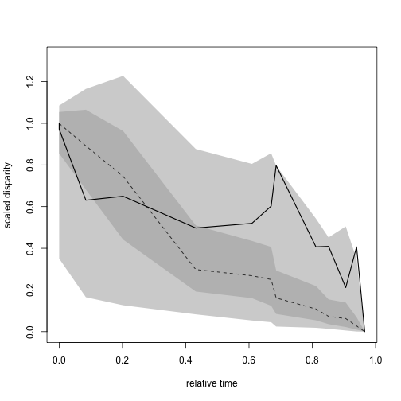

Note that, like in the original `dtt` function, it is possible to change the evolutionary model (see `?geiger::sim.char` documentation).

### null morphospace testing with `null.test`

This test is equivalent to the test performed in @diaz2016global.
It compares the disparity measured in the observed space to the disparity measured in a set of simulated spaces.
These simulated spaces can be built with based on the hypothesis assumptions: for example, we can test whether our space is normal.


```r
set.seed(123)
## A "normal" multidimensional space with 50 dimensions and 10 elements
normal_space <- matrix(rnorm(1000), ncol = 50)

## Calculating the disparity as the average pairwise distances
obs_disparity <- dispRity(normal_space, metric = c(mean, pairwise.dist))

## Testing against 100 randomly generated normal spaces
(results <- null.test(obs_disparity, replicates = 100, null.distrib = rnorm))
```

```
## Monte-Carlo test
## Call: [1] "dispRity::null.test"
## 
## Observation: 9.910536 
## 
## Based on 100 replicates
## Simulated p-value: 0.7524752 
## Alternative hypothesis: two-sided 
## 
##     Std.Obs Expectation    Variance 
## -0.24885893  9.96420000  0.04650127
```

Here the results show that disparity measured in our observed space is not significantly different than the one measured in a normal space.
We can then propose that our observed space is normal!

These results have an attributed `dispRity` and `randtest` class and can be plotted as `randtest` objects using the `dispRity` S3 `plot` method:


```r
## Plotting the results
plot(results, main = "Is this space normal?")
```

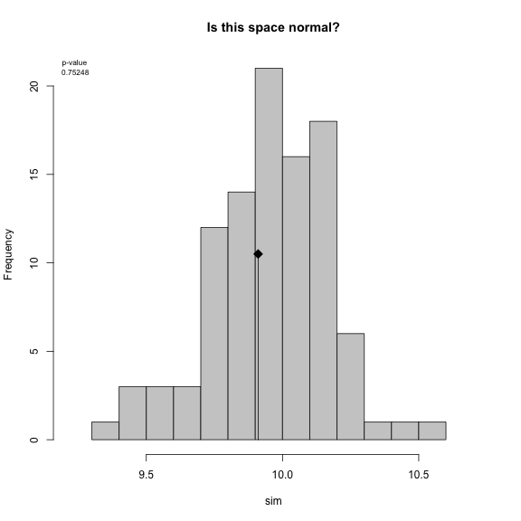

For more details on generating spaces see the [`space.maker`](#Simulating-multidimensional-spaces) function tutorial.


## Fitting modes of evolution to disparity data

The code used for these models is based on those developed by Gene Hunt [@hunt2006fitting; @hunt2012measuring; @hunt2015simple].
So we acknowledge and thank Gene Hunt for developing these models and writing the original R code that served as inspiration for these models.

### Simple modes of disparity change through time

#### `model.test`

Changes in disparity-through-time can follow a range of models, such as random walks, stasis, constrained evolution, trends, or an early burst model of evolution.
We will start with by fitting the simplest modes of evolution to our data.
For example we may have a null expectation of time-invariant change in disparity in which values fluctuate with a variance around the mean - this would be best describe by a Stasis model:


```r
## Loading premade disparity data
data(BeckLee_disparity)
disp_time <- model.test(data = BeckLee_disparity, model = "Stasis")
```

```
## Evidence of equal variance (Bartlett's test of equal variances p = 0).
## Variance is not pooled.
## Running Stasis model...Done. Log-likelihood = -59.501
```

We can see the standard output from ```model.test```.
The first output message tells us it has tested for equal variances in each sample.
The model uses Bartlett's test of equal variances to assess if variances are equal, so if p > 0.05 then variance is treated as the same for all samples, but if (p < 0.05) then each bin variance is unique.
Here we have p < 0.05, so variance is not pooled between samples. 

By default ```model.test``` will use Bartlett's test to assess for homogeneity of variances, and then use this to decide to pool variances or not.
This is ignored if the argument ```pool.variance``` in ```model.test``` is changed from the default ```NULL``` to ```TRUE``` or ```FALSE```.
For example, to ignore Bartlett's test and pool variances manually we would do the following:


```r
disp_time_pooled <- model.test(data = BeckLee_disparity, model = "Stasis", pool.variance = TRUE)
```

```
## Running Stasis model...Done. Log-likelihood = -58.233
```

However, unless you have good reason to choose otherwise it is recommended to use the default of ```pool.variance = NULL```:


```r
disp_time <- model.test(data = BeckLee_disparity, model = "Stasis", pool.variance = NULL)
```

```
## Evidence of equal variance (Bartlett's test of equal variances p = 0).
## Variance is not pooled.
## Running Stasis model...Done. Log-likelihood = -59.501
```

```r
disp_time
```

```
## Disparity evolution model fitting:
## Call: model.test(data = BeckLee_disparity, model = "Stasis", pool.variance = NULL) 
## 
##            aicc delta_aicc weight_aicc
## Stasis 123.1027          0           1
## 
## Use x$full.details for displaying the models details
## or summary(x) for summarising them.
```

The remaining output gives us the log-likelihood of the Stasis model of -59.501 (you may notice this change when we pooled variances above).
The output also gives us the small sample Akaike Information Criterion (AICc), the delta AICc (the distance from the best fitting model), and the AICc weights (~the relative support of this model compared to all models, scaled to one). 

These are all metrics of relative fit, so when we test a single model they are not useful.
By using the function summary in ```dispRity``` we can see the maximum likelihood estimates of the model parameters:


```r
summary(disp_time)
```

```
##         aicc delta_aicc weight_aicc log.lik param theta.1 omega
## Stasis 123.1          0           1   -59.5     2     3.4   0.1
```

So we again see the AICc, delta AICc, AICc weight, and the log-likelihood we saw previously.
We now also see the number of parameters from the model (2: theta and omega), and their estimates so the variance (omega = 0.01) and the mean (theta.1 = 3.4).

The ```model.test``` function is designed to test relative model fit, so we need to test more than one model to make relative comparisons.
So let's compare to the fit of the Stasis model to another model with two parameters: the Brownian motion.
Brownian motion assumes a constant mean that is equal to the ancestral estimate of the sequence, and the variance around this mean increases linearly with time.
The easier way to compare these models is to simply add `"BM"` to the ```models``` vector argument:


```r
disp_time <- model.test(data = BeckLee_disparity, model = c("Stasis", "BM"))
```

```
## Evidence of equal variance (Bartlett's test of equal variances p = 0).
## Variance is not pooled.
## Running Stasis model...Done. Log-likelihood = -59.501
## Running BM model...Done. Log-likelihood = 123.938
```

```r
disp_time
```

```
## Disparity evolution model fitting:
## Call: model.test(data = BeckLee_disparity, model = c("Stasis", "BM")) 
## 
##             aicc delta_aicc  weight_aicc
## Stasis  123.1027   366.8774 2.155677e-80
## BM     -243.7747     0.0000 1.000000e+00
## 
## Use x$full.details for displaying the models details
## or summary(x) for summarising them.
```

Et voilà! Here we can see by the log-likelihood, AICc, delta AICc, and AICc weight Brownian motion has a much better relative fit to these data than the Stasis model.
Brownian motion has a relative AICc fit 366 units better than Stasis, and virtually has a AICc weight of 1. 

We can also all the information about the relative fit of models alongside the maximum likelihood estimates of model parameters using the summary function


```r
summary(disp_time)
```

```
##        aicc delta_aicc weight_aicc log.lik param theta.1 omega
## Stasis  123      366.9           0   -59.5     2   3.403  0.15
## BM     -244        0.0           1   123.9     2      NA    NA
##        ancestral state sigma squared
## Stasis              NA            NA
## BM               2.858         0.003
```

Not that because the parameters per models differ, the summary includes `NA` for inapplicable parameters per models (e.g. the theta and omega parameters from the Stasis models are inapplicable for a Brownian motion model).


We can plot the relative fit of our models using the ```plot``` function


```r
plot(disp_time)
```

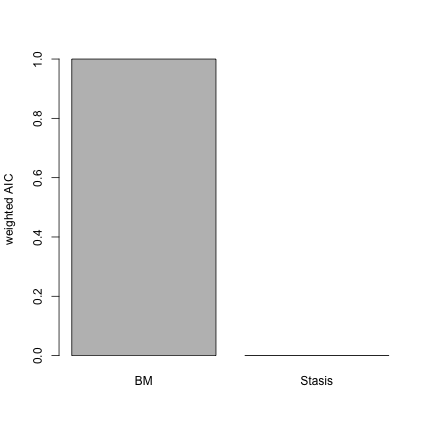

Here we see and overwhelming support for the Brownian motion model.

Alternatively, we could test all available models single modes: Stasis, Brownian motion, Ornstein-Uhlenbeck (evolution constrained to an optima), Trend (increasing or decreasing mean through time), and Early Burst (exponentially decreasing rate through time)


```r
disp_time <- model.test(data = BeckLee_disparity, model = c("Stasis", "BM", "OU", "Trend", "EB"))
```

```
## Evidence of equal variance (Bartlett's test of equal variances p = 0).
## Variance is not pooled.
## Running Stasis model...Done. Log-likelihood = -59.501
## Running BM model...Done. Log-likelihood = 123.938
## Running OU model...Done. Log-likelihood = 126.431
## Running Trend model...Done. Log-likelihood = 126.361
## Running EB model...Done. Log-likelihood = 113.081
```

```r
summary(disp_time)
```

```
##        aicc delta_aicc weight_aicc log.lik param theta.1 omega
## Stasis  123      369.6       0.000   -59.5     2   3.403  0.15
## BM     -244        2.7       0.157   123.9     2      NA    NA
## OU     -245        2.0       0.227   126.4     4      NA    NA
## Trend  -247        0.0       0.617   126.4     3      NA    NA
## EB     -220       26.6       0.000   113.1     3      NA    NA
##        ancestral state sigma squared alpha optima.1 trend     eb
## Stasis              NA            NA    NA       NA    NA     NA
## BM               2.858         0.003    NA       NA    NA     NA
## OU               2.835         0.002 0.004    5.707    NA     NA
## Trend            2.839         0.002    NA       NA  0.01     NA
## EB               4.055         0.002    NA       NA    NA -0.014
```

These models indicate support for a Trend model, and we can plot the relative support of all model AICc weights.


```r
plot(disp_time)
```

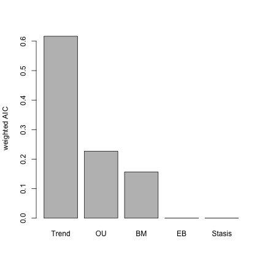

> Note that although AIC values are indicator of model best fit, it is also important to look at the parameters themselves.
For example OU can be really well supported but with an alpha parameter really close to 0, making it effectively a BM model [@Cooper2016].

Is this a trend of increasing or decreasing disparity through time? One way to find out is to look at the summary function for the Trend model:


```r
summary(disp_time)["Trend",]
```

```
##            aicc      delta_aicc     weight_aicc         log.lik 
##        -247.000           0.000           0.617         126.400 
##           param         theta.1           omega ancestral state 
##           3.000              NA              NA           2.839 
##   sigma squared           alpha        optima.1           trend 
##           0.002              NA              NA           0.010 
##              eb 
##              NA
```

This show a positive trend (0.01) of increasing disparity through time.

### Plot and run simulation tests in a single step

#### `model.test.wrapper`

Patterns of evolution can be fit using ```model.test```, but the ```model.test.wrapper``` fits the same models as `model.test` as well as running predictive tests and plots.

The predictive tests use the maximum likelihood estimates of model parameters to simulate a number of datasets (default = 1000), and analyse whether this is significantly different to the empirical input data using the Rank Envelope test [@murrell2018global].
Finally we can plot the empirical data, simulated data, and the Rank Envelope test p values.
This can all be done using the function ```model.test.wrapper```, and we will set the argument ```show.p = TRUE``` so _p_ values from the Rank Envelope test are printed on the plot:


```r
disp_time <- model.test.wrapper(data = BeckLee_disparity, model = c("Stasis", "BM", "OU", "Trend", "EB"),
                                show.p = TRUE)
```

```
## Evidence of equal variance (Bartlett's test of equal variances p = 0).
## Variance is not pooled.
## Running Stasis model...Done. Log-likelihood = -59.501
## Running BM model...Done. Log-likelihood = 123.938
## Running OU model...Done. Log-likelihood = 126.431
## Running Trend model...Done. Log-likelihood = 126.361
## Running EB model...Done. Log-likelihood = 113.081
```

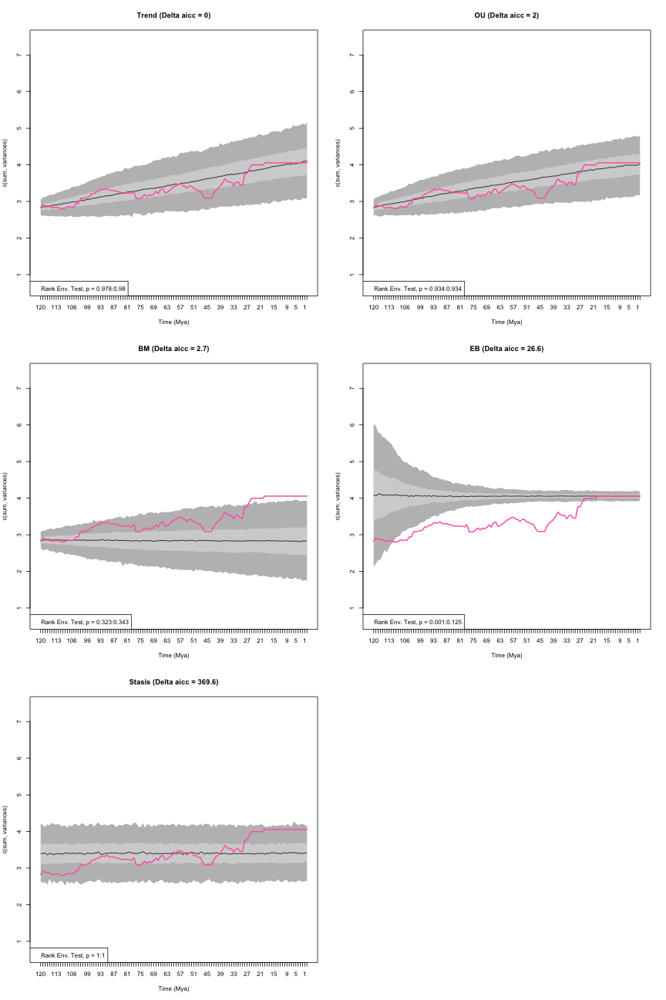

```r
disp_time
```

```
##        aicc delta_aicc weight_aicc log.lik param theta.1 omega
## Trend  -247        0.0       0.617   126.4     3      NA    NA
## OU     -245        2.0       0.227   126.4     4      NA    NA
## BM     -244        2.7       0.157   123.9     2      NA    NA
## EB     -220       26.6       0.000   113.1     3      NA    NA
## Stasis  123      369.6       0.000   -59.5     2   3.403  0.15
##        ancestral state sigma squared alpha optima.1 trend     eb
## Trend            2.839         0.002    NA       NA  0.01     NA
## OU               2.835         0.002 0.004    5.707    NA     NA
## BM               2.858         0.003    NA       NA    NA     NA
## EB               4.055         0.002    NA       NA    NA -0.014
## Stasis              NA            NA    NA       NA    NA     NA
##        median p value lower p value upper p value
## Trend      0.97902098   0.978021978     0.9800200
## OU         0.93406593   0.934065934     0.9340659
## BM         0.33266733   0.322677323     0.3426573
## EB         0.06293706   0.000999001     0.1248751
## Stasis     1.00000000   1.000000000     1.0000000
```

From this plot we can see the empirical estimates of disparity through time (pink) compared to the predictive data based upon the simulations using the estimated parameters from each model.
There is no significant differences between the empirical data and simulated data, except for the Early Burst model.

Trend is the best-fitting model but the plot suggests the OU model also follows a trend-like pattern.
This is because the optima for the OU model (5.7) is different to the ancestral state 2.835 and outside the observed value.
This is potentially unrealistic, and one way to alleviate this issue is to set the optima of the OU model to equal the ancestral estimate - this is the normal practice for OU models in comparative phylogenetics.
To set the optima to the ancestral value we change the argument ```fixed.optima = TRUE```:


```r
disp_time <- model.test.wrapper(data = BeckLee_disparity, model = c("Stasis", "BM", "OU", "Trend", "EB"),
                                show.p = TRUE, fixed.optima = TRUE)
```

```
## Evidence of equal variance (Bartlett's test of equal variances p = 0).
## Variance is not pooled.
## Running Stasis model...Done. Log-likelihood = -59.501
## Running BM model...Done. Log-likelihood = 123.938
## Running OU model...Done. Log-likelihood = 123.938
## Running Trend model...Done. Log-likelihood = 126.361
## Running EB model...Done. Log-likelihood = 113.081
```


```r
disp_time
```

```
##        aicc delta_aicc weight_aicc log.lik param theta.1 omega
## Trend  -247        0.0       0.745   126.4     3      NA    NA
## BM     -244        2.7       0.189   123.9     2      NA    NA
## OU     -242        4.8       0.066   123.9     3      NA    NA
## EB     -220       26.6       0.000   113.1     3      NA    NA
## Stasis  123      369.6       0.000   -59.5     2   3.403  0.15
##        ancestral state sigma squared alpha trend     eb median p value
## Trend            2.839         0.002    NA  0.01     NA     0.97402597
## BM               2.858         0.003    NA    NA     NA     0.29870130
## OU               2.858         0.003     0    NA     NA     0.35864136
## EB               4.055         0.002    NA    NA -0.014     0.06393606
## Stasis              NA            NA    NA    NA     NA     1.00000000
##        lower p value upper p value
## Trend    0.973026973     0.9750250
## BM       0.285714286     0.3116883
## OU       0.347652348     0.3696304
## EB       0.000999001     0.1268731
## Stasis   1.000000000     1.0000000
```

The relative fit of the OU model is decreased by constraining the fit of the optima to equal the ancestral state value.
In fact as the OU attraction parameter (alpha) is zero, the model is equal to a Brownian motion model but is penalised by having an extra parameter. 
Note that indeed, the plots of the BM model and the OU model look nearly identical.

### Multiple modes of evolution (time shifts)

As well as fitting a single model to a sequence of disparity values we can also allow for the mode of evolution to shift at a single or multiple points in time.
The timing of a shift in mode can be based on an a prior expectation, such as a mass extinction event, or the model can test multiple points to allow to find time shift point with the highest likelihood.

Models can be fit using `model.test` but it can be more convenient to use `model.test.wrapper`.
Here we will compare the relative fit of Brownian motion, Trend, Ornstein-Uhlenbeck and a multi-mode Ornstein Uhlenbck model in which the optima changes at 66 million years ago, the Cretaceous-Palaeogene boundary.

For example, we could be testing the hypothesis that the extinction of non-avian dinosaurs allowed mammals to go from scurrying in the undergrowth (low optima/low disparity) to dominating all habitats (high optima/high disparity).
We will constrain the optima of OU model in the first time begin (i.e, pre-66 Mya) to equal the ancestral value:


```r
disp_time <- model.test.wrapper(data = BeckLee_disparity, model = c("BM", "Trend", "OU", "multi.OU"),
                                time.split = 66, pool.variance = NULL, show.p = TRUE,
                                fixed.optima = TRUE)
```

```
## Evidence of equal variance (Bartlett's test of equal variances p = 0).
## Variance is not pooled.
## Running BM model...Done. Log-likelihood = 123.938
## Running Trend model...Done. Log-likelihood = 126.361
## Running OU model...Done. Log-likelihood = 123.938
## Running multi.OU model...Done. Log-likelihood = 126.469
```


```r
disp_time
```

```
##          aicc delta_aicc weight_aicc log.lik param ancestral state
## Trend    -247      0.000       0.580   126.4     3           2.839
## multi.OU -245      1.922       0.222   126.5     4           2.836
## BM       -244      2.742       0.147   123.9     2           2.858
## OU       -242      4.845       0.051   123.9     3           2.858
##          sigma squared trend alpha optima.2 median p value lower p value
## Trend            0.002  0.01    NA       NA      0.9920080     0.9920080
## multi.OU         0.002    NA 0.005    5.526      0.6308691     0.6263736
## BM               0.003    NA    NA       NA      0.3506494     0.3396603
## OU               0.003    NA 0.000       NA      0.3666334     0.3576424
##          upper p value
## Trend        0.9920080
## multi.OU     0.6353646
## BM           0.3616384
## OU           0.3756244
```

The multi-OU model shows an increase an optima at the Cretaceous-Palaeogene boundary, indicating a shift in disparity.
However, this model does not fit as well as a model in which there is an increasing trend through time.
We can also fit a model in which the we specify a heterogeneous model but we do not give a `time.split`.
In this instance the model will test all splits that have at least 10 time slices on either side of the split.
That's 102 potential time shifts in this example dataset so be warned, the following code will estimate 105 models!


```r
## An example of a time split model in which all potential splits are tested
## WARNING: this will take between 20 minutes and half and hour to run!
disp_time <- model.test.wrapper(data = BeckLee_disparity, model = c("BM", "Trend", "OU", "multi.OU"),
                                show.p = TRUE, fixed.optima = TRUE)
```

As well as specifying a multi-OU model we can run any combination of models.
For example we could fit a model at the Cretaceous-Palaeogene boundary that goes from an OU to a BM model, a Trend to an OU model, a Stasis to a Trend model or any combination you want to use.
The only model that can't be used in combination is a multi-OU model.

These can be introduced by changing the input for the models into a list, and supplying a vector with the two models.
This is easier to see with an example:


```r
## The models to test
my_models <- list(c("BM", "OU"),
                  c("Stasis", "OU"),
                  c("BM", "Stasis"),
                  c("OU", "Trend"),
                  c("Stasis", "BM"))

## Testing the models
disp_time <- model.test.wrapper(data = BeckLee_disparity, model = my_models, time.split = 66,
                                show.p = TRUE, fixed.optima = TRUE)
```

```
## Evidence of equal variance (Bartlett's test of equal variances p = 0).
## Variance is not pooled.
## Running BM:OU model...Done. Log-likelihood = 115.367
## Running Stasis:OU model...Done. Log-likelihood = 80.16
## Running BM:Stasis model...Done. Log-likelihood = 34.278
## Running OU:Trend model...Done. Log-likelihood = 118.166
## Running Stasis:BM model...Done. Log-likelihood = 80.16
```

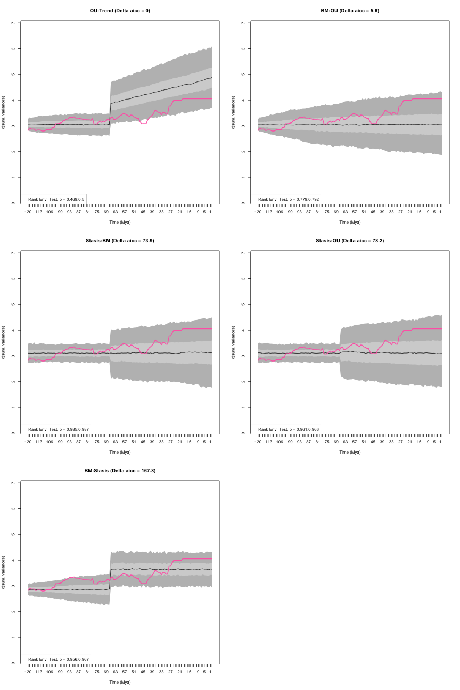

```r
disp_time
```

```
##           aicc delta_aicc weight_aicc log.lik param ancestral state
## OU:Trend  -228        0.0       0.943   118.2     4           3.051
## BM:OU     -222        5.6       0.057   115.4     4           3.052
## Stasis:BM -154       73.9       0.000    80.2     3              NA
## Stasis:OU -150       78.2       0.000    80.2     5              NA
## BM:Stasis  -60      167.8       0.000    34.3     4           2.858
##           sigma squared alpha optima.1 theta.1 omega trend median p value
## OU:Trend          0.003 0.039       NA      NA    NA 0.015      0.4840160
## BM:OU             0.003 0.000    4.055      NA    NA    NA      0.7857143
## Stasis:BM         0.004    NA       NA   3.109 0.025    NA      0.9860140
## Stasis:OU         0.004 0.000    4.055   3.109 0.025    NA      0.9635365
## BM:Stasis         0.002    NA       NA   3.648 0.113    NA      0.9615385
##           lower p value upper p value
## OU:Trend      0.4685315     0.4995005
## BM:OU         0.7792208     0.7922078
## Stasis:BM     0.9850150     0.9870130
## Stasis:OU     0.9610390     0.9660340
## BM:Stasis     0.9560440     0.9670330
```

### `model.test.sim`

Note that all the models above where run using the `model.test.wrapper` function that is a... wrapping function!
In practice, this function runs two main functions from the `dispRity` package and then plots the results:

 * `model.test` and
 * `model.test.sim`

The `model.test.sim` allows to simulate disparity evolution given a `dispRity` object input (as in `model.test.wrapper`) or given a model and its specification.
For example, it is possible to simulate a simple Brownian motion model (or any of the other models or models combination described above):


```r
## A simple BM model
model_simulation <- model.test.sim(sim = 1000, model = "BM", time.span = 50, variance = 0.1,
                                   sample.size = 100, parameters = list(ancestral.state = 0))
model_simulation
```

```
## Disparity evolution model simulation:
## Call: model.test.sim(sim = 1000, model = "BM", time.span = 50, variance = 0.1, sample.size = 100, parameters = list(ancestral.state = 0)) 
## 
## Model simulated (1000 times):
## [1] "BM"
```

This will simulate 1000 Brownian motions for 50 units of time with 100 sampled elements, a variance of 0.1 and an ancestral state of 0.
We can also pass multiple models in the same way we did it for `model.test`
This model can then be summarised and plotted as most `dispRity` objects:


```r
## Displaying the 5 first rows of the summary
head(summary(model_simulation))
```

```
##   subsets   n var      median      2.5%       25%       75%    97.5%
## 1      50 100 0.1 -0.09312806 -1.718481 -0.712478 0.5854576 1.772700
## 2      49 100 0.1 -0.01881396 -2.697017 -0.967495 0.9105681 2.712452
## 3      48 100 0.1 -0.06914146 -3.443629 -1.205211 1.1171606 3.185465
## 4      47 100 0.1 -0.01584249 -3.897544 -1.474240 1.3762412 3.639836
## 5      46 100 0.1 -0.04118287 -4.402526 -1.496096 1.5347916 4.239536
## 6      45 100 0.1 -0.17175251 -4.764863 -1.697076 1.5894314 4.349500
```

```r
## Plotting the simulations
plot(model_simulation)
```


Note that these functions can take all the arguments that can be passed to `plot`, `summary`, `plot.dispRity` and `summary.dispRity`.

#### Simulating tested models

Maybe more interestingly though, it is possible to pass the output of `model.test` directly to `model.test.sim` to simulate the models that fits the data the best and calculate the Rank Envelope test _p_ value.
Let's see that using the simple example from the start:


```r
## Fitting multiple models on the data set
disp_time <- model.test(data = BeckLee_disparity, model = c("Stasis", "BM", "OU", "Trend", "EB"))
```

```
## Evidence of equal variance (Bartlett's test of equal variances p = 0).
## Variance is not pooled.
## Running Stasis model...Done. Log-likelihood = -59.501
## Running BM model...Done. Log-likelihood = 123.938
## Running OU model...Done. Log-likelihood = 126.431
## Running Trend model...Done. Log-likelihood = 126.361
## Running EB model...Done. Log-likelihood = 113.081
```

```r
summary(disp_time)
```

```
##        aicc delta_aicc weight_aicc log.lik param theta.1 omega
## Stasis  123      369.6       0.000   -59.5     2   3.403  0.15
## BM     -244        2.7       0.157   123.9     2      NA    NA
## OU     -245        2.0       0.227   126.4     4      NA    NA
## Trend  -247        0.0       0.617   126.4     3      NA    NA
## EB     -220       26.6       0.000   113.1     3      NA    NA
##        ancestral state sigma squared alpha optima.1 trend     eb
## Stasis              NA            NA    NA       NA    NA     NA
## BM               2.858         0.003    NA       NA    NA     NA
## OU               2.835         0.002 0.004    5.707    NA     NA
## Trend            2.839         0.002    NA       NA  0.01     NA
## EB               4.055         0.002    NA       NA    NA -0.014
```

As seen before, the Trend model fitted this dataset the best.
To simulate what 1000 Trend models would look like using the same parameters as the ones estimated with `model.test` (here the ancestral state being 2.839, the sigma squared beeing 0.002 and the trend of 0.01), we can simply pass this model to `model.test.sim`:


```r
## Simulating 1000 Trend model with the observed parameters
sim_trend <- model.test.sim(sim = 1000, model = disp_time)
sim_trend
```

```
## Disparity evolution model simulation:
## Call: model.test.sim(sim = 1000, model = disp_time) 
## 
## Model simulated (1000 times):
##       aicc log.lik param ancestral state sigma squared trend
## Trend -247   126.4     3           2.839         0.002  0.01
## 
## Rank envelope test
##  p-value of the test: 0.987013 (ties method: midrank)
##  p-interval         : (0.987013, 0.987013)
```

By default, the model simulated is the one with the lowest AICc (`model.rank = 1`) but it is possible to choose any ranked model, for example, the OU (second one):


```r
## Simulating 1000 OU model with the observed parameters
sim_OU <- model.test.sim(sim = 1000, model = disp_time, model.rank = 2)
sim_OU
```

```
## Disparity evolution model simulation:
## Call: model.test.sim(sim = 1000, model = disp_time, model.rank = 2) 
## 
## Model simulated (1000 times):
##    aicc log.lik param ancestral state sigma squared alpha optima.1
## OU -245   126.4     4           2.835         0.002 0.004    5.707
## 
## Rank envelope test
##  p-value of the test: 0.8971029 (ties method: midrank)
##  p-interval         : (0.8941059, 0.9000999)
```

And as the example above, the simulated data can be plotted or summarised:


```r
head(summary(sim_trend))
```

```
##   subsets n        var   median     2.5%      25%      75%    97.5%
## 1     120 5 0.06056490 2.837869 2.614855 2.760862 2.908493 3.059927
## 2     119 5 0.07453663 2.858233 2.598562 2.756114 2.945448 3.106885
## 3     118 6 0.07556947 2.856971 2.589279 2.769942 2.941288 3.129721
## 4     117 6 0.07556947 2.870782 2.584536 2.777017 2.965582 3.147397
## 5     116 6 0.07556947 2.869144 2.589171 2.769528 2.978955 3.173132
## 6     115 7 0.06590243 2.883672 2.593479 2.790683 2.978769 3.179178
```

```r
head(summary(sim_OU))
```

```
##   subsets n        var   median     2.5%      25%      75%    97.5%
## 1     120 5 0.06056490 2.832068 2.618984 2.759091 2.908017 3.051097
## 2     119 5 0.07453663 2.849006 2.592719 2.759753 2.940149 3.115460
## 3     118 6 0.07556947 2.858304 2.579423 2.767239 2.946567 3.125425
## 4     117 6 0.07556947 2.872844 2.585720 2.782702 2.971421 3.142925
## 5     116 6 0.07556947 2.881609 2.599897 2.779863 2.985630 3.168541
## 6     115 7 0.06590243 2.897410 2.602577 2.790346 2.998301 3.182402
```


```r
## The trend model with some graphical options
plot(sim_trend, xlab = "Time (Mya)", ylab = "sum of variances",
    col = c("#F65205", "#F38336", "#F7B27E"))

## Adding the observed disparity through time
plot(BeckLee_disparity, add = TRUE, col = c("#3E9CBA", "#98D4CF90", "#BFE4E390"))
```

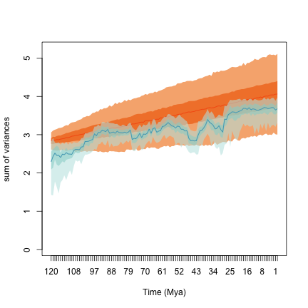


## Disparity as a distribution

Disparity is often regarded as a summary value of the position of the all elements in the ordinated space.
For example, the sum of variances, the product of ranges or the median distance between the elements and their centroid will summarise disparity as a single value.
This value can be pseudo-replicated (bootstrapped) to obtain a distribution of the summary metric with estimated error.
However, another way to perform disparity analysis is to use the *whole distribution* rather than just a summary metric (e.g. the variances or the ranges).

This is possible in the `dispRity` package by calculating disparity as a dimension-level 2 metric only!
Let's have a look using our [previous example](#summarising-dispRity-data-plots) of bootstrapped time slices but by measuring the distances between each taxon and their centroid as disparity.


```r
## Measuring disparity as a whole distribution
disparity_centroids <- dispRity(boot_time_slices, metric = centroids)
```

The resulting disparity object is of dimension-level 2, so it can easily be transformed into a dimension-level 1 object by, for example, measuring the median distance of all these distributions:


```r
## Measuring median disparity in each time slice
disparity_centroids_median <- dispRity(disparity_centroids, metric = median)
```

And we can now compare the differences between these methods:


```r
## Summarising both disparity measurements:
## The distributions:
summary(disparity_centroids)
```

```
##   subsets  n obs.median bs.median  2.5%   25%   75% 97.5%
## 1     120  5      1.508     1.287 0.533 1.108 1.554 1.865
## 2      80 19      1.790     1.690 1.406 1.583 1.816 1.948
## 3      40 15      1.689     1.676 1.318 1.556 1.835 2.077
## 4       0 10      1.910     1.804 1.308 1.676 1.963 2.104
```

```r
## The summary of the distributions (as median)
summary(disparity_centroids_median)
```

```
##   subsets  n   obs bs.median  2.5%   25%   75% 97.5%
## 1     120  5 1.508     1.348 0.506 0.959 1.477 1.508
## 2      80 19 1.790     1.687 1.572 1.649 1.721 1.774
## 3      40 15 1.689     1.681 1.508 1.644 1.716 1.805
## 4       0 10 1.910     1.808 1.577 1.763 1.860 1.909
```

We can see that the summary message for the distribution is slightly different than before.
Here `summary` also displays the observed central tendency (i.e. the central tendency of the measured distributions).
Note that, as expected, this central tendency is the same in both metrics!

Another, maybe more intuitive way, to compare both approaches for measuring disparity is to plot the distributions:


```r
## Graphical parameters
op <- par(bty = "n", mfrow = c(1, 2))

## Plotting both disparity measurements
plot(disparity_centroids, ylab = "Distribution of all the distances")
plot(disparity_centroids_median,
     ylab = "Distribution of the medians of all the distances")
```

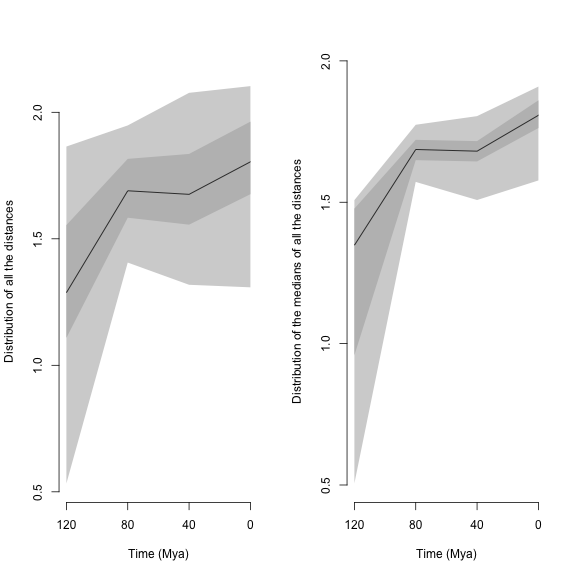

```r
par(op)
```

We can then test for differences in the resulting distributions using `test.dispRity` and the `bhatt.coeff` test as described above.


```r
## Probability of overlap in the distribution of medians
test.dispRity(disparity_centroids_median, test = bhatt.coeff)
```

```
## Warning in test.dispRity(disparity_centroids_median, test = bhatt.coeff): Multiple p-values will be calculated without adjustment!
## This can inflate Type I error!
```

```
##          bhatt.coeff
## 120 : 80  0.04472136
## 120 : 40  0.22865118
## 120 : 0   0.08972003
## 80 : 40   0.93790685
## 80 : 0    0.58236752
## 40 : 0    0.63822722
```

In this case, we are looking at the probability of overlap of the distribution of median distances from centroids among each pair of time slices.
In other words, we are measuring whether the medians from each bootstrap pseudo-replicate for each time slice overlap.
But of course, we might be interested in the actual distribution of the distances from the centroid rather than simply their central tendencies.
This can be problematic depending on the research question asked since we are effectively comparing non-independent medians distributions (because of the pseudo-replication).

One solution, therefore, is to look at the full distribution:


```r
## Probability of overlap for the full distributions
test.dispRity(disparity_centroids, test = bhatt.coeff)
```

```
## Warning in test.dispRity(disparity_centroids, test = bhatt.coeff): Multiple p-values will be calculated without adjustment!
## This can inflate Type I error!
```

```
##          bhatt.coeff
## 120 : 80   0.6438966
## 120 : 40   0.6875980
## 120 : 0    0.5877450
## 80 : 40    0.9337141
## 80 : 0     0.8537184
## 40 : 0     0.9359091
```

These results show the actual overlap among all the measured distances from centroids concatenated across all the bootstraps.
For example, when comparing the slices 120 and 80, we are effectively comparing the 5 $\times$ 100 distances (the distances of the five elements in slice 120 bootstrapped 100 times) to the 19 $\times$ 100 distances from slice 80.
However, this can also be problematic for some specific tests since the _n_ $\times$ 100 distances are also pseudo-replicates and thus are still not independent.

A second solution is to compare the distributions to each other _for each replicate_:


```r
## Boostrapped probability of overlap for the full distributions
test.dispRity(disparity_centroids, test = bhatt.coeff, concatenate = FALSE)
```

```
## Warning in test.dispRity(disparity_centroids, test = bhatt.coeff, concatenate = FALSE): Multiple p-values will be calculated without adjustment!
## This can inflate Type I error!
```

```
##          bhatt.coeff      2.5%       25%       75%     97.5%
## 120 : 80   0.2940881 0.0000000 0.2051957 0.4290170 0.6083311
## 120 : 40   0.2824927 0.0000000 0.1632993 0.3983128 0.7481392
## 120 : 0    0.2281964 0.0000000 0.0000000 0.3464102 0.6309343
## 80 : 40    0.6306073 0.2955680 0.4959277 0.7596775 0.8698180
## 80 : 0     0.4795679 0.1348897 0.3715678 0.5988888 0.7732118
## 40 : 0     0.5381616 0.2309401 0.3995782 0.7026658 0.8009602
```

These results show the median overlap among pairs of distributions in the first column (`bhatt.coeff`) and then the distribution of these overlaps among each pair of bootstraps.
In other words, when two distributions are compared, they are now compared for each bootstrap pseudo-replicate, thus effectively creating a distribution of probabilities of overlap.
For example, when comparing the slices 120 and 80, we have a mean probability of overlap of 0.28 and a probability between 0.18 and 0.43 in 50\% of the pseudo-replicates.
Note that the quantiles and central tendencies can be modified via the `conc.quantiles` option.


## Disparity from other matrices

In the example so far, disparity was measured from an ordinated multidimensional space (i.e. a PCO of the distances between taxa based on discrete morphological characters).
This is a common approach in palaeobiology, morphometrics or ecology but ordinated matrices are not mandatory for the `dispRity` package!
It is totally possible to perform the same analysis detailed above using other types of matrices as long as your elements are rows in your matrix.

For example, we can use the data set `eurodist`, an `R` inbuilt dataset that contains the distances (in km) between European cities.
We can check for example, if Northern European cities are closer to each other than Southern ones:


```r
## Making the eurodist data set into a matrix (rather than "dist" object)
eurodist <- as.matrix(eurodist)
eurodist[1:5, 1:5]
```

```
##           Athens Barcelona Brussels Calais Cherbourg
## Athens         0      3313     2963   3175      3339
## Barcelona   3313         0     1318   1326      1294
## Brussels    2963      1318        0    204       583
## Calais      3175      1326      204      0       460
## Cherbourg   3339      1294      583    460         0
```

```r
## The two groups of cities
Northern <- c("Brussels", "Calais", "Cherbourg", "Cologne", "Copenhagen",
              "Hamburg", "Hook of Holland", "Paris", "Stockholm")
Southern <- c("Athens", "Barcelona", "Geneva", "Gibraltar", "Lisbon", "Lyons",
              "Madrid", "Marseilles", "Milan", "Munich", "Rome", "Vienna")

## Creating the subset dispRity object
eurodist_subsets <- custom.subsets(eurodist, group = list("Northern" = Northern,
                                                        "Southern" = Southern))
```

```
## Warning: custom.subsets is applied on what seems to be a distance matrix.
## The resulting matrices won't be distance matrices anymore!
```

```r
## Bootstrapping and rarefying to 9 elements (the number of Northern cities)
eurodist_bs <- boot.matrix(eurodist_subsets, rarefaction = 9)

## Measuring disparity as the median distance from group's centroid
euro_disp <- dispRity(eurodist_bs, metric = c(median, centroids))

## Testing the differences using a simple wilcox.test
euro_diff <- test.dispRity(euro_disp, test = wilcox.test)
euro_diff_rar <- test.dispRity(euro_disp, test = wilcox.test, rarefaction = 9)
```

We can compare this approach to an ordination one:


```r
## Ordinating the eurodist matrix
euro_ord <- cmdscale(eurodist, k = nrow(eurodist) - 2)
```

```
## Warning in cmdscale(eurodist, k = nrow(eurodist) - 2): only 11 of the first
## 19 eigenvalues are > 0
```

```r
## Calculating disparity on the bootstrapped and rarefied subset data
euro_ord_disp <- dispRity(boot.matrix(custom.subsets(euro_ord, group =
        list("Northern" = Northern, "Southern" = Southern)), rarefaction = 9),
        metric = c(median, centroids))

## Testing the differences using a simple wilcox.test
euro_ord_diff <- test.dispRity(euro_ord_disp, test = wilcox.test)
euro_ord_diff_rar <- test.dispRity(euro_ord_disp, test = wilcox.test, rarefaction = 9)
```

And visualise the differences:


```r
## Plotting the differences
par(mfrow = c(2,2), bty = "n")
## Plotting the normal disparity
plot(euro_disp, main = "Distance differences")
## Adding the p-value
text(1.5, 4000, paste0("p=",round(euro_diff[[2]][[1]], digit = 5)))
## Plotting the rarefied disparity
plot(euro_disp, rarefaction = 9, main = "Distance differences (rarefied)")
## Adding the p-value
text(1.5, 4000, paste0("p=",round(euro_diff_rar[[2]][[1]], digit = 5)))

## Plotting the ordinated disparity
plot(euro_ord_disp, main = "Ordinated differences")
## Adding the p-value
text(1.5, 1400, paste0("p=",round(euro_ord_diff[[2]][[1]], digit = 5) ))
## Plotting the rarefied disparity
plot(euro_ord_disp, rarefaction = 9, main = "Ordinated differences (rarefied)")
## Adding the p-value
text(1.5, 1400, paste0("p=",round(euro_ord_diff_rar[[2]][[1]], digit = 5) ))
```

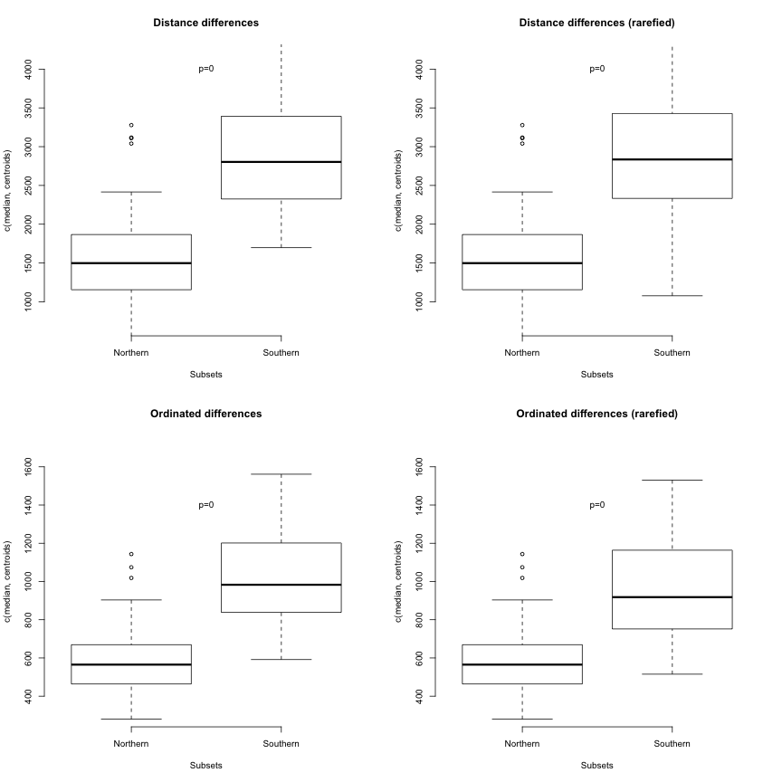

As expected, the results are pretty similar in pattern but different in terms of scale.
The median centroids distance is expressed in km in the "Distance differences" plots and in Euclidean units of variation in the "Ordinated differences" plots.

<!--chapter:end:03_specific-tutorials.Rmd-->

---
title: "Data simulation features"
author: "Thomas Guillerme (guillert@tcd.ie) and Natalie Cooper (natalie.cooper@nhm.ac.uk)"
date: "2019-03-06"
bibliography: [../References.bib, ../packages.bib]
output:
  html_document: default
  pdf_document: default
---

# Making stuff up!

The `dispRity` package also offers some advanced data simulation features to allow to test hypothesis, explore multidimensional spaces, metrics properties or simply playing around with data!
All the following functions are based on the same modular architecture of the package and therefore can be used with most of the functions of the package.

## Simulating discrete morphological data

The function `sim.morpho` allows to simulate discrete morphological data matrices (sometimes referred to as "cladistic" matrices).
It allows to evolve multiple discrete characters on a given phylogenetic tree, given different evolutionary models, rates, and states.
It even allows to include proper inapplicable data to make datasets as messy as in real life!

In brief, the function `sim.morpho` takes a phylogenetic tree, the number of required characters, the evolutionary model and a function from which to draw the rates.
The package also contains a function for quickly checking the matrix's phylogenetic signal (as defined in systematics not phylogenetic comparative methods) using parsimony.
The methods are described in details below


```r
set.seed(3)
## Simulating a starting tree with 15 taxa as a random coalescent tree
my_tree <- rcoal(15)

## Generating a matrix with 100 characters (85% binary and 15% three state) and
## an equal rates model with a gamma rate distribution (0.5, 1) with no 
## invariant characters.
my_matrix <- sim.morpho(tree = my_tree, characters = 100, states = c(0.85,
    0.15), rates = c(rgamma, shape = 0.5, rate = 1), invariant = FALSE)

## The first few lines of the matrix
my_matrix[1:10, 1:10]
```

```
##     [,1] [,2] [,3] [,4] [,5] [,6] [,7] [,8] [,9] [,10]
## t15 "1"  "1"  "0"  "1"  "1"  "2"  "1"  "1"  "0"  "0"  
## t12 "1"  "1"  "0"  "1"  "1"  "2"  "1"  "1"  "0"  "0"  
## t14 "1"  "1"  "0"  "1"  "1"  "2"  "1"  "1"  "0"  "0"  
## t6  "1"  "1"  "0"  "1"  "1"  "2"  "1"  "1"  "0"  "0"  
## t3  "0"  "0"  "1"  "0"  "1"  "0"  "0"  "2"  "1"  "0"  
## t2  "0"  "0"  "1"  "0"  "1"  "0"  "0"  "2"  "1"  "0"  
## t11 "0"  "0"  "1"  "0"  "1"  "0"  "0"  "2"  "1"  "1"  
## t7  "0"  "0"  "1"  "0"  "1"  "0"  "0"  "2"  "1"  "0"  
## t1  "0"  "0"  "1"  "0"  "0"  "0"  "0"  "2"  "0"  "0"  
## t5  "0"  "0"  "1"  "0"  "0"  "0"  "0"  "2"  "0"  "0"
```

```r
## Checking the matrix properties with a quick Maximum Parsimony tree search
check.morpho(my_matrix, my_tree)
```

```
##                                     
## Maximum parsimony        139.0000000
## Consistency index          0.7625899
## Retention index            0.8881356
## Robinson-Foulds distance   0.0000000
```

Note that this example produces a tree with a great consistency index and an identical topology to the random coalescent tree!

### A more detailed description

The protocol implemented here to generate discrete morphological matrices is based on the ones developed in @GuillermeCooper @OReilly2016 @puttick2017uncertain and @OReilly2017.

 * The first `tree` argument will be the tree on which to "evolve" the characters and therefore requires branch length.
 You can generate quick and easy random Yule trees using `ape::rtree(number_of_taxa)` but I would advise to use more realistic trees for more realistic simulations based on more realistic models (really realistic then) using the function `tree.bd` from the [`diversitree`](http://www.zoology.ubc.ca/prog/diversitree/) package [@fitzjohndiversitree2012] for example.
 * The second argument, `character` is the number of characters.
 * The third, `states` is the proportion of characters states above two. This argument intakes the proportion of *n*-states characters, for example `states = c(0.5,0.3,0.2)` will generate 50% of binary-state characters, 30% of three-state characters and 20% of four-state characters. There is no limit in the number of state characters proportion as long as the total makes up 100%. 
 * The fourth, `model` is the evolutionary model for generating the character(s). More about this below.
 * The fifth and sixth, `rates` and `substitution` are the model parameters described below as well.
 * Finally, the two logical arguments, are self explanatory: `invariant` whether to allow invariant characters (i.e. characters that don't change) and `verbose` whether to print the simulation progress on your console.

#### Available evolutionary models

There are currently three evolutionary models implemented in `sim.morpho` but more will come in the future.
Note also that they allow fine tuning parameters making them pretty plastic!

 * `"ER"`: this model allows any number of character states and is based on the Mk model [@lewisa2001]. It assumes a unique overall evolutionary rate equal substitution rate between character states. This model is based on the `ape::rTraitDisc` function.
 * `"HKY"`: this is binary state character model based on the molecular HKY model [@HKY85]. It uses the four molecular states (A,C,G,T) with a unique overall evolutionary rate and a biased substitution rate towards transitions (A <-> G or C <-> T) against transvertions (A <-> C and G <-> T). After evolving the nucleotides, this model transforms them into binary states by converting the purines (A and G) into state 0 and the pyrimidines (C and T) into state 1. This method is based on the `phyclust::seq.gen.HKY` function and was first proposed by @OReilly2016.
 * `"MIXED"`: this model uses a random (uniform) mix between both the `"ER"` and the `"HKY"` models.

The models can take the following parameters:
(1) `rates` is the evolutionary rate (i.e. the rate of changes along a branch; the evolutionary speed) and (2) `substitution` is the frequency of changes between one state or another.
For example if a character can have high probability of changing (the *evolutionary* rate) with, each time a change occurs a probability of changing from state *X* to state *Y* (the *substitution* rate).
Note that in the `"ER"` model, the substitution rate is ignore because by definition this rate is equal!

The parameters arguments `rates` and `substitution` takes a distributions from which to draw the parameters values for each character.
For example, if you want an `"HKY"` model with an evolutionary rate (i.e. speed) drawn from a uniform distribution bounded between 0.001 and 0.005, you can define it as `rates = c(runif, min = 0.001, max = 0.005)`, `runif` being the function for random draws from a uniform distribution and `max` and `min` being the distribution parameters.
These distributions should always be passed in the format `c(random_distribution_function, distribution_parameters)` with the names of the distribution parameters arguments.

#### Checking the results

An additional function, `check.morpho` runs a quick Maximum Parsimony tree search using the `phangorn` parsimony algorithm.
It quickly calculates the parsimony score, the consistency and retention indices and, if a tree is provided (e.g. the tree used to generate the matrix) it calculates the Robinson-Foulds distance between the most parsimonious tree and the provided tree to determine how different they are.

#### Adding inapplicable characters

Once a matrix is generated, it is possible to apply inapplicable characters to it for increasing realism!
Inapplicable characters are commonly designated as `NA` or simply `-`.
They differ from missing characters `?` in their nature by being inapplicable rather than unknown.
For example, considering a binary character defined as "colour of the tail" with the following states "blue" and "red"; on a taxa with no tail, the character should be coded as inapplicable ("`-`") since the state of the character "colour of tail" is *known*: it's neither "blue" or "red", it's just not there!
It contrasts with coding it as missing ("`?`" - also called as ambiguous) where the state is *unknown*, for example, the taxon of interest is a fossil where the tail has no colour preserved or is not present at all due to bad conservation!

This type of characters can be added to the simulated matrices using the `apply.NA` function.
It takes, as arguments, the `matrix`, the source of inapplicability (`NAs` - more below), the `tree` used to generate the matrix and the two same `invariant` and `verbose` arguments as defined above.
The `NAs` argument allows two types of sources of inapplicability:

 * `"character"` where the inapplicability is due to the character (e.g. coding a character tail for species with no tail).
 In practice, the algorithm chooses a character *X* as the underlying character (e.g. "presence and absence of tail"), arbitrarily chooses one of the states as "absent" (e.g. 0 = absent) and changes in the next character *Y* any state next to character *X* state 0 into an inapplicable token ("`-`").
 This simulates the inapplicability induced by coding the characters (i.e. not always biological).
 * `"clade"` where the inapplicability is due to evolutionary history (e.g. a clade loosing its tail).
 In practice, the algorithm chooses a random clade in the tree and a random character *Z* and replaces the state of the taxa present in the clade by the inapplicable token ("`-`").
 This simulates the inapplicability induced by evolutionary biology (e.g. the lose of a feature in a clade).

To apply these sources of inapplicability, simply repeat the number of inapplicable sources for the desired number of characters with inapplicable data.


```r
## Generating 5 "character" NAs and 10 "clade" NAs
my_matrix_NA <- apply.NA(my_matrix, tree = my_tree,
                         NAs = c(rep("character", 5), rep("clade", 10)))

## The first few lines of the resulting matrix
my_matrix_NA[1:10, 90:100]
```

```
##     [,1] [,2] [,3] [,4] [,5] [,6] [,7] [,8] [,9] [,10] [,11]
## t15 "0"  "1"  "0"  "1"  "0"  "0"  "0"  "1"  "0"  "1"   "0"  
## t12 "1"  "1"  "0"  "1"  "0"  "0"  "0"  "1"  "0"  "1"   "0"  
## t14 "0"  "0"  "0"  "1"  "0"  "0"  "0"  "1"  "0"  "1"   "0"  
## t6  "0"  "0"  "0"  "1"  "0"  "0"  "0"  "1"  "0"  "1"   "0"  
## t3  "0"  "0"  "1"  "0"  "-"  "0"  "0"  "0"  "-"  "0"   "1"  
## t2  "0"  "0"  "1"  "0"  "-"  "0"  "0"  "0"  "-"  "0"   "1"  
## t11 "0"  "0"  "1"  "0"  "-"  "0"  "0"  "0"  "-"  "0"   "1"  
## t7  "0"  "0"  "1"  "0"  "-"  "0"  "0"  "0"  "-"  "0"   "1"  
## t1  "0"  "0"  "0"  "0"  "-"  "0"  "0"  "0"  "-"  "2"   "1"  
## t5  "0"  "0"  "0"  "0"  "-"  "0"  "0"  "0"  "-"  "0"   "1"
```
<!--TG: Add inapplicable paper here -->

### Parameters for a realistic(ish) matrix

There are many parameters that can create a "realistic" matrix (i.e. not too different from the input tree with a consistency and retention index close to what is seen in the literature) but because of the randomness of the matrix generation not all parameters combination end up creating "good" matrices.
The following parameters however, seem to generate fairly "realist" matrices with a starting coalescent tree, equal rates model with 0.85 binary characters and 0.15 three state characters, a gamma distribution with a shape parameter ($\alpha$) of 10 and no scaling ($\beta$ = 1) with a rate of 50.


```r
set.seed(0)
## tree
my_tree <- rcoal(30)
## matrix
morpho_mat <- sim.morpho(tree = my_tree, characters = 100, states = c(0.85,
    0.15), rates = c(rgamma, shape = 10, rate = 50), invariant = FALSE)

check.morpho(morpho_mat, my_tree)
```

```
##                                     
## Maximum parsimony        133.0000000
## Consistency index          0.7819549
## Retention index            0.9597222
## Robinson-Foulds distance   4.0000000
```

<!-- ## Simulating continuous morphological data -->
<!-- TG: Add tutorial for evolving "morpho" shapes -->


## Simulating multidimensional spaces
Another way to simulate data is to directly simulate a multidimensional space with the `space.maker` function.
This function allows users to simulate spaces with a certain number of properties.
For example, it is possible to design a space with a specific distribution on each axis, a correlation between the axes and a specific cumulative variance per axis.
This can be useful for creating ordinated spaces for null hypothesis, for example if you're using the function `null.test` [@diaz2016global].

This function takes as arguments the number of elements (data points - `elements` argument) and dimensions (`dimensions` argument) to create the space and the distribution functions to be used for each axis.
The distributions are passed through the `distribution` argument as modular functions.
You can either pass a single distribution function for all the axes (for example `distribution = runif` for all the axis being uniform) or a specific distribution function for each specific axis (for example `distribution = c(runif, rnorm, rgamma))` for the first axis being uniform, the second normal and the third gamma).
You can of course use your very own functions or use the ones implemented in `dispRity` for more complex ones (see below).
Specific optional arguments for each of these distributions can be passed as a list via the `arguments` argument.

Furthermore, it is possible to add a correlation matrix to add a correlation between the axis via the `cor.matrix` argument or even a vector of proportion of variance to be bear by each axis via the `scree` argument to simulate realistic ordinated spaces. 

Here is a simple two dimensional example:


```r
## Graphical options
op <- par(bty = "n")

## A square space
square_space <- space.maker(100, 2, runif)

## The resulting 2D matrix
head(square_space)
```

```
##           [,1]       [,2]
## [1,] 0.3322704 0.73741888
## [2,] 0.5157255 0.33160759
## [3,] 0.3716847 0.62284731
## [4,] 0.4367013 0.76535328
## [5,] 0.7424290 0.07764732
## [6,] 0.0111013 0.65066885
```

```r
## Visualising the space
plot(square_space, pch = 20, xlab = "", ylab = "", main = "Uniform 2D space")
```

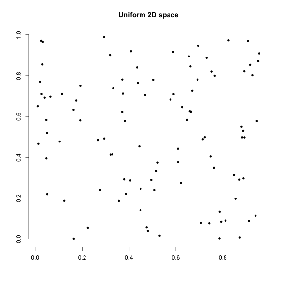

Of course, more complex spaces can be created by changing the distributions, their arguments or adding a correlation matrix or a cumulative variance vector:


```r
## A plane space: uniform with one dimensions equal to 0
plane_space <- space.maker(2500, 3, c(runif, runif, runif),
                           arguments = list(list(min = 0, max = 0), NULL, NULL))
head(plane_space)
```

```
##      [,1]       [,2]       [,3]
## [1,]    0 0.18294640 0.32682604
## [2,]    0 0.67243526 0.77182827
## [3,]    0 0.56028603 0.06603386
## [4,]    0 0.80409259 0.19401581
## [5,]    0 0.31732158 0.16460302
## [6,]    0 0.09244429 0.99873117
```

```r
## Correlation matrix for a 3D space
(cor_matrix <- matrix(cbind(1, 0.8, 0.2, 0.8, 1, 0.7, 0.2, 0.7, 1), nrow = 3))
```

```
##      [,1] [,2] [,3]
## [1,]  1.0  0.8  0.2
## [2,]  0.8  1.0  0.7
## [3,]  0.2  0.7  1.0
```

```r
## An ellipsoid space (normal space with correlation)
ellipse_space <- space.maker(2500, 3, rnorm, cor.matrix = cor_matrix)
head(ellipse_space)
```

```
##            [,1]       [,2]       [,3]
## [1,] -0.5080285 -0.7014059 -1.0286500
## [2,]  0.7250674  0.9498248  0.7220638
## [3,]  0.4476787  0.2102857 -0.3835125
## [4,] -1.3252827 -0.5060518  0.2211104
## [5,] -0.9193155 -1.3861888 -1.6151720
## [6,] -0.7217653 -0.1967257  0.2672965
```

```r
## A cylindrical space with decreasing axes variance
cylindrical_space <- space.maker(2500, 3, c(rnorm, rnorm, runif),
                                 scree = c(0.7, 0.2, 0.1))
head(cylindrical_space)
```

```
##             [,1]        [,2]         [,3]
## [1,] -0.07935545  0.10932383 0.0017309562
## [2,] -0.20619425 -0.14809591 0.0008416656
## [3,] -0.20133258  0.05766707 0.0041888464
## [4,]  0.69412491 -0.47106729 0.0036967387
## [5,]  0.41300602  0.23924098 0.0077537936
## [6,]  0.53369953  0.02882589 0.0073476805
```

See below for the visualisation of the spaces.

### Personalised dimensions distributions

Following the modular architecture of the package, it is of course possible to pass home made distribution functions to the `distribution` argument.
For example, the `random.circle` function is a personalised one implemented in `dispRity`.
This function allows to create circles based on trigonometry allowing two axis to covary to produce circle coordinates.
By default, this function generates two sets of coordinates with a `distribution` argument and a minimum and maximum boundary (`inner` and `outer` respectively) to create nice sharp edges to the circle.
The maximum boundary is equivalent to the radius of the circle (it removes coordinates beyond the circle radius) and the minimum is equivalent to the radius of a smaller circle with no data (it removes coordinates below this inner circle radius).


```r
## Graphical options
op <- par(bty = "n")

## Generating coordinates for a normal circle with a upper boundary of 1
circle <- random.circle(1000, rnorm, inner = 0, outer = 1)

## Plotting the circle
plot(circle, xlab = "x", ylab = "y", main = "A normal circle")
```

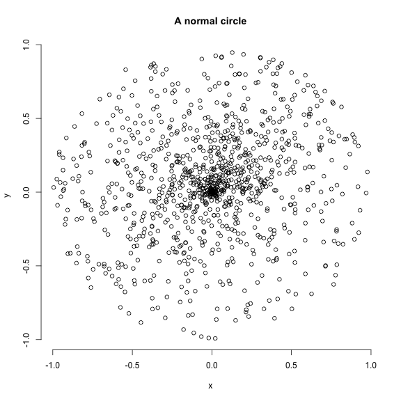

```r
## Creating doughnut space (a spherical space with a hole)
doughnut_space <- space.maker(5000, 3, c(rnorm, random.circle),
     arguments = list(list(mean = 0), list(runif, inner = 0.5, outer = 1)))
head(doughnut_space)
```

```
##            [,1]        [,2]       [,3]
## [1,]  1.0692065 -0.34286592 -0.4077478
## [2,]  0.3898210 -0.06393936  0.5212298
## [3,] -0.9878641  0.36223496  0.4519167
## [4,]  0.1031183  0.08781562  0.9176893
## [5,]  1.1351951 -0.34076407  0.8712020
## [6,]  0.1769964 -0.77904629  0.5770467
```

See below for the visualisation of the "doughnut" space.

### Visualising the space

I suggest using the excellent `scatterplot3d` package to play around and visualise the simulated spaces:


```r
## Graphical options
op <- par(mfrow = (c(2, 2)), bty = "n")
## Visualising 3D spaces
require(scatterplot3d)
```

```
## Loading required package: scatterplot3d
```

```r
## The plane space
scatterplot3d(plane_space, pch = 20, xlab = "", ylab = "", zlab = "",
              xlim = c(-0.5, 0.5), main = "Plane space")

## The ellipsoid space
scatterplot3d(ellipse_space, pch = 20, xlab = "", ylab = "", zlab = "",
              main = "Normal ellipsoid space")

## A cylindrical space with a decreasing variance per axis
scatterplot3d(cylindrical_space, pch = 20, xlab = "", ylab = "", zlab = "",
              main = "Normal cylindrical space")
## Axes have different orders of magnitude

## Plotting the doughnut space
scatterplot3d(doughnut_space[,c(2,1,3)], pch = 20, xlab = "", ylab = "",
              zlab = "", main = "Doughnut space")
```

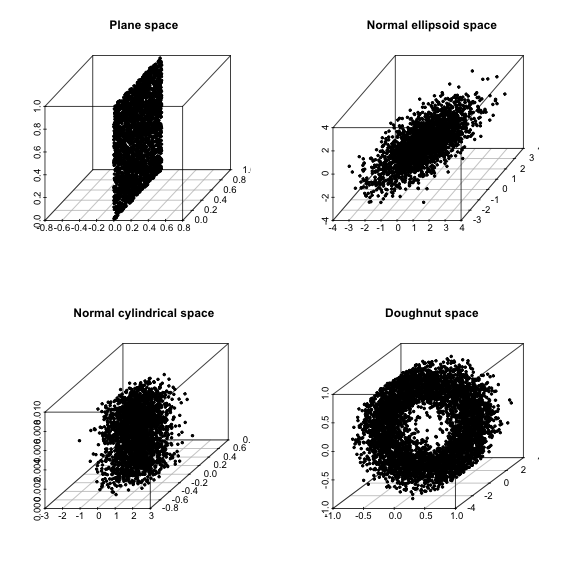

```r
par(op)
```


### Generating realistic spaces

It is possible to generate "realistic" spaces by simply extracting the parameters of an existing space and scaling it up to the simulated space.
For example, we can extract the parameters of the `BeckLee_mat50` ordinated space and simulate a similar space.


```r
## Loading the data
data(BeckLee_mat50)

## Number of dimensions
obs_dim <- ncol(BeckLee_mat50)

## Observed correlation between the dimensions
obs_correlations <- cor(BeckLee_mat50)

## Observed mean and standard deviation per axis
obs_mu_sd_axis <- mapply(function(x,y) list("mean" = x, "sd" = y),
                         as.list(apply(BeckLee_mat50, 2, mean)),
                         as.list(apply(BeckLee_mat50, 2, sd)), SIMPLIFY = FALSE)

## Observed overall mean and standard deviation
obs_mu_sd_glob <- list("mean" = mean(BeckLee_mat50), "sd" = sd(BeckLee_mat50))

## Scaled observed variance per axis (scree plot)
obs_scree <- variances(BeckLee_mat50)/sum(variances(BeckLee_mat50))

## Generating our simulated space
simulated_space <- space.maker(1000, dimensions = obs_dim, 
                               distribution = rep(list(rnorm), obs_dim),
                               arguments = obs_mu_sd_axis,
                               cor.matrix = obs_correlations)

## Visualising the fit of our data in the space (in the two first dimensions)
plot(simulated_space[,1:2], xlab = "PC1", ylab = "PC2")
points(BeckLee_mat50[,1:2], col = "red", pch = 20)
legend("topleft", legend = c("observed", "simulated"),
        pch = c(20,21), col = c("red", "black"), bg = "white")
```

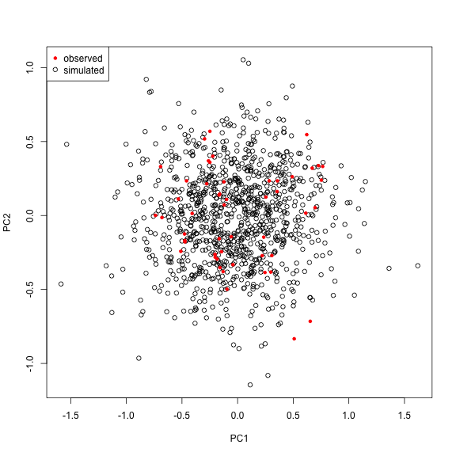

It is now possible to simulate a space using these observed arguments to test several hypothesis:

 * Is the space uniform or normal?
 * If the space is normal, is the mean and variance global or specific for each axis?


```r
## Measuring disparity as the sum of variance
observed_disp <- dispRity(BeckLee_mat50, metric = c(median, centroids))

## Is the space uniform?
test_unif <- null.test(observed_disp, null.distrib = runif)

## Is the space normal with a mean of 0 and a sd of 1?
test_norm1 <- null.test(observed_disp, null.distrib = rnorm)

## Is the space normal with the observed mean and sd and cumulative variance
test_norm2 <- null.test(observed_disp, null.distrib = rep(list(rnorm), obs_dim),
                        null.args = rep(list(obs_mu_sd_glob), obs_dim),
                        null.scree = obs_scree)

## Is the space multiple normal with multiple means and sds and a correlation?
test_norm3 <- null.test(observed_disp, null.distrib = rep(list(rnorm), obs_dim),
                        null.args = obs_mu_sd_axis, null.cor = obs_correlations)


## Graphical options
op <- par(mfrow = (c(2, 2)), bty = "n")
## Plotting the results
plot(test_unif, main = "Uniform (0,1)")
plot(test_norm1, main = "Normal (0,1)")
plot(test_norm2, main = "Normal (global observed\nmean and sd)")
plot(test_norm3, main = "Normal (variable mean\nand sd with correlation)")
```

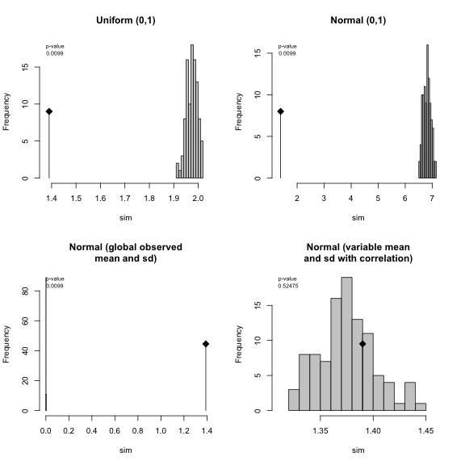

If we measure disparity as the median distance from the morphospace centroid, we can explain the distribution of the data as normal with the variable observed mean and standard deviation and with a correlation between the dimensions.

<!--chapter:end:04_making-up-data.Rmd-->

---
title: "The guts of the dispRity package"
author: "Thomas Guillerme (guillert@tcd.ie)"
date: "2019-03-06"
bibliography: [../References.bib, ../packages.bib]
output:
  html_document: default
  pdf_document: default
---


# The guts of the `dispRity` package

## Manipulating `dispRity` objects

Disparity analysis involves a lot of manipulation of many matrices (especially when bootstrapping) which can be impractical to visualise and will quickly overwhelm your `R` console.
Even the simple Beck and Lee 2014 example above produces an object with > 72 lines of lists of lists of matrices!

Therefore `dispRity` uses a specific class of object called a `dispRity` object.
These objects allow users to use S3 method functions such as `summary.dispRity`, `plot.dispRity` and `print.dispRity`. 
`dispRity` also contains various utility functions that manipulate the `dispRity` object (e.g. `sort.dispRity`, `extract.dispRity` see the full list in the next section).
These functions modify the `dispRity` object without having to delve into its complex structure!
The full structure of a `dispRity` object is detailed [here](https://github.com/TGuillerme/dispRity/blob/master/disparity_object.md).


```r
## Loading the example data
data(disparity)

## What is the class of the median_centroids object?
class(disparity)
```

```
## [1] "dispRity"
```

```r
## What does the object contain?
names(disparity)
```

```
## [1] "matrix"    "call"      "subsets"   "disparity"
```

```r
## Summarising it using the S3 method print.dispRity
disparity
```

```
##  ---- dispRity object ---- 
## 7 continuous (acctran) time subsets for 99 elements with 97 dimensions:
##      90, 80, 70, 60, 50 ...
## Data was bootstrapped 100 times (method:"full") and rarefied to 20, 15, 10, 5 elements.
## Disparity was calculated as: c(median, centroids).
```

Note that it is always possible to recall the full object using the argument `all = TRUE` in `print.dispRity`:


```r
## Display the full object
print(disparity, all = TRUE)
## This is more nearly ~ 5000 lines on my 13 inch laptop screen!
```

## `dispRity` utilities

The package also provides some utility functions to facilitate multidimensional analysis.

### `dispRity` object utilities  <a name="dispRity.utilities"></a>
The first set of utilities are functions for manipulating `dispRity` objects:

#### `make.dispRity`
This function creates empty `dispRity` objects.


```r
## Creating an empty dispRity object
make.dispRity()
```

```
## Empty dispRity object.
```

```r
## Creating an "empty" dispRity object with a matrix
(disparity_obj <- make.dispRity(matrix(rnorm(20), 5, 4)))
```

```
##  ---- dispRity object ---- 
## Contains only a matrix 5x4.
```

####  `fill.dispRity`
This function initialises a `dispRity` object and generates its call properties.


```r
## The dispRity object's call is indeed empty
disparity_obj$call
```

```
## list()
```

```r
## Filling an empty disparity object (that needs to contain at least a matrix)
(disparity_obj <- fill.dispRity(disparity_obj))
```

```
##  ---- dispRity object ---- 
## 5 elements with 4 dimensions.
```

```r
## The dipRity object has now the correct minimal attributes
disparity_obj$call
```

```
## $dimensions
## [1] 4
```

####  `matrix.dispRity`
This function extracts a specific matrix from a disparity object.
The matrix can be one of the bootstrapped matrices or/and a rarefied matrix.


```r
## Extracting the matrix containing the coordinates of the elements at time 50
str(matrix.dispRity(disparity, "50"))
```

```
##  num [1:18, 1:97] -0.1038 0.2844 0.2848 0.0927 0.1619 ...
##  - attr(*, "dimnames")=List of 2
##   ..$ : chr [1:18] "Leptictis" "Dasypodidae" "n24" "Potamogalinae" ...
##   ..$ : NULL
```

```r
## Extracting the 3rd bootstrapped matrix with the 2nd rarefaction level
## (15 elements) from the second group (80 Mya)
str(matrix.dispRity(disparity, subsets = 1, bootstrap = 3, rarefaction = 2))
```

```
##  num [1:15, 1:97] -0.6937 -0.0445 -0.673 -0.7161 -0.2046 ...
##  - attr(*, "dimnames")=List of 2
##   ..$ : chr [1:15] "Kennalestes" "n20" "Batodon" "n7" ...
##   ..$ : NULL
```

#### `get.subsets`
This function creates a dispRity object that contains only elements from one specific subsets.


```r
## Extracting all the data for the crown mammals
(crown_mammals <- get.subsets(disp_crown_stemBS, "Group.crown"))

## The object keeps the properties of the parent object but is composed of only one subsets
length(crown_mammals$subsets)
```

#### `combine.subsets`
This function allows to merge different subsets.
If the 


```r
## Combine the two first subsets in the dispRity data example
combine.subsets(disparity, c(1,2))
```

Note that the computed values (bootstrapped data + disparity metric) are not merge.

#### `extract.dispRity`
This function extracts the calculated disparity values of a specific matrix.


```r
## Extracting the observed disparity (default)
extract.dispRity(disparity)

## Extracting the disparity from the bootstrapped values from the
## 10th rarefaction level from the second subsets (80 Mya)
extract.dispRity(disparity, observed = FALSE, subsets = 2, rarefaction = 10)
```

#### `rescale.dispRity`
This is the modified S3 method for `scale` (scaling and/or centring) that can be applied to the disparity data of a `dispRity` object and can take optional arguments (for example the rescaling by dividing by a maximum value).


```r
## Getting the disparity values of the time subsets
head(summary(disparity))

## Scaling the same disparity values
head(summary(rescale.dispRity(disparity, scale = TRUE)))

## Scaling and centering:
head(summary(rescale.dispRity(disparity, scale = TRUE, center = TRUE)))

## Rescaling the value by dividing by a maximum value
head(summary(rescale.dispRity(disparity, max = 10)))
```

#### `sort.dispRity`
This is the S3 method of `sort` for sorting the subsets alphabetically (default) or following a specific pattern.


```r
## Sorting the disparity subsets in inverse alphabetic order
head(summary(sort(disparity, decreasing = TRUE)))

## Customised sorting
head(summary(sort(disparity, sort = c(7, 1, 3, 4, 5, 2, 6))))
```


## The `dispRity` object content
The functions above are utilities to easily and safely access different elements in the `dispRity` object.
Alternatively, of course, each elements can be accessed manually.
Here is an explanation on how it works.
The `dispRity` object is a `list` of two to four elements, each of which are detailed below:

 * `$matrix`: an object of class `matrix`, the full multidimensional space.
 * `$call`: an object of class `list` containing information on the `dispRity` object content.
 * `$subsets`: an object of class `list` containing the subsets of the multidimensional space.
 * `$disparity`: an object of class `list` containing the disparity values.

The `dispRity` object is loosely based on `C` structure objects.
In fact, it is composed of one unique instance of a matrix (the multidimensional space) upon which the metric function is called via "pointers" to only a certain number of elements and/or dimensions of this matrix.
This allows for: (1) faster and easily tractable execution time: the metric functions are called through apply family function and can be parallelised; and (2) a really low memory footprint:  at any time, only one matrix is present in the `R` environment rather than multiple copies of it for each subset.

### `$matrix`
This is the multidimensional space, stored in the `R` environment as a `matrix` object.
It requires row names but not column names.
By default, if the row names are missing, `dispRity` function will arbitrarily generate them in numeric order (i.e. `rownames(matrix) <- 1:nrow(matrix)`).
This element of the `dispRity` object is never modified.

### `$call`
This element contains the information on the `dispRity` object content.
It is a `list` that can contain the following:

 * `$call$subsets`: a vector of `character` with information on the subsets type (either `"continuous"`, `"discrete"` or `"custom"`) and their eventual model (`"acctran"`, `"deltran"`, `"random"`, `"proximity"`, `"equal.split"`, `"gradual.split"`). This element generated only once via `chrono.subsets()` and `custom.subsets()`.
 * `$call$dimensions`: either a single `numeric` value indicating how many dimensions to use or a vector of `numeric` values indicating which specific dimensions to use. This element is by default the number of columns in `$matrix` but can be modified through `boot.matrix()` or `dispRity()`.
 * `$call$bootstrap`: this is a `list` containing three elements:
    * `[[1]]`: the number of bootstrap replicates (`numeric`)
    * `[[2]]`: the bootstrap method (`character`)
    * `[[3]]`: the rarefaction levels (`numeric` vector)
 * `$call$disparity`: this is a `list` containing one element, `$metric`, that is a `list` containing the different functions passed to the `metric` argument in `dispRity`. These are `call` elements and get modified each time the `dispRity` function is used (the first element is the first metric(s), the second, the second metric(s), etc.).

### `$subsets`
This element contain the eventual subsets of the multidimensional space.
It is a `list` of subset names.
Each subset name is in turn a `list` of at least one element called `elements` which is in turn a `matrix`.
This `elements` matrix is the raw (observed) elements in the subsets.
The `elements` matrix is composed of `numeric` values in one column and _n_ rows (the number of elements in the subset).
Each of these values are a "pointer" (`C` inspired) to the element of the `$matrix`.
For example, lets assume a `dispRity` object called `disparity`, composed of at least one subsets called `sub1`:

```
 disparity$subsets$sub1$elements
      [,1]
 [1,]    5
 [2,]    4
 [3,]    6
 [4,]    7
```

The values in the matrix "point" to the elements in `$matrix`: here, the multidimensional space with only the 4th, 5th, 6th and 7th elements.
The following elements in `diparity$subsets$sub1` will correspond to the same "pointers" but drawn from the bootstrap replicates.
The columns will correspond to different bootstrap replicates.
For example:

```
 disparity$subsets$sub1[[2]]
      [,1] [,2] [,3] [,4]
 [1,]   57   43   70    4
 [2,]   43   44    4    4
 [3,]   42   84   44    1
 [4,]   84    7    2   10
```
This signifies that we have four bootstrap pseudo-replicates pointing each time to four elements in `$matrix`.
The next element (`[[3]]`) will be the same for the eventual first rarefaction level (i.e. the resulting bootstrap matrix will have _m_ rows where _m_ is the number of elements for this rarefaction level).
The next element after that (`[[4]]`) will be the same for with an other rarefaction level and so forth...

### `$disparity`
The `$disparity` element is identical to the `$subsets` element structure (a list of list(s) containing matrices) but the matrices don't contain "pointers" to `$matrix` but the disparity result of the disparity metric applied to the "pointers".
For example, in our first example (`$elements`) from above, if the disparity metric is of dimensions level 1, we would have:

```
 disparity$disparity$sub1$elements
      [,1]
 [1,]    1.82
```

This is the observed disparity (1.82) for the subset called `sub1`.
If the disparity metric is of dimension level 2 (say the function `range` that outputs two values), we would have:

```
 disparity$disparity$sub1$elements
      [,1]
 [1,]    0.82
 [2,]    2.82
```

The following elements in the list follow the same logic as before: rows are disparity values (one row for a dimension level 1 metric, multiple for a dimensions level 2 metric) and columns are the bootstrap replicates (the bootstrap with all elements followed by the eventual rarefaction levels).
For example for the bootstrap without rarefaction (second element of the list):

```
 disparity$disparity$sub1[[2]]
         [,1]     [,2]     [,3]     [,4]
[1,] 1.744668 1.777418 1.781624 1.739679 
```


<!-- ## Modularity

### Making your own metrics

### Making your own tests

## Where is this going?
 -->
<!-- ## Running `dispRity` in parallel

The computationally intensive function `dispRity` have a `parallel` option to speed up their calculations.

This option requires the package `snow` and takes arguments that are to be passed to  -->

<!--chapter:end:05_guts.Rmd-->

---
title: "Palaeobiology demo: disparity-through-time and within groups"
author: "Thomas Guillerme (guillert@tcd.ie) and Natalie Cooper (natalie.cooper@nhm.ac.uk)"
date: "2019-03-06"
bibliography: [../References.bib, ../packages.bib]
output:
  html_document: default
  pdf_document: default
---


# Palaeobiology demo: disparity-through-time and within groups

This demo aims to give quick overview of the `dispRity` package (v.1.2) for palaeobiology analyses of disparity, including disparity through time analyses.

This demo showcases a typical disparity-through-time analysis: we are going to test whether the disparity changed through time in a subset of eutherian mammals from the last 100 million years using a dataset from Beck and Lee (2014).

## Before starting

### The morphospace


In this example, we are going to use a subset of the data from @beckancient2014.
See the [example data](#example-data) description for more details.
Briefly, this dataset contains an ordinated matrix of 50 discrete characters from mammals (`BeckLee_mat50`), another matrix of the same 50 mammals and the estimated discrete data characters of their descendants (thus 50 + 49 rows, `BeckLee_mat99`), a dataframe containing the ages of each taxon in the dataset (`BeckLee_ages`) and finally a phylogenetic tree with the relationships among the 50 mammals (`BeckLee_tree`).
The ordinated matrix will represent our full morphospace, i.e. all the mammalian morphologies that ever existed through time (for this dataset).


```r
## Loading demo and the package data
library(dispRity)

## Setting the random seed for repeatability
set.seed(123)

## Loading the ordinated matrix/morphospace:
data(BeckLee_mat50)
head(BeckLee_mat50[,1:5])
```

```
##                    [,1]          [,2]        [,3]       [,4]      [,5]
## Cimolestes   -0.5319679  0.1117759259  0.09865194 -0.1933148 0.2035833
## Maelestes    -0.4087147  0.0139690317  0.26268300  0.2297096 0.1310953
## Batodon      -0.6923194  0.3308625215 -0.10175223 -0.1899656 0.1003108
## Bulaklestes  -0.6802291 -0.0134872777  0.11018009 -0.4103588 0.4326298
## Daulestes    -0.7386111  0.0009001369  0.12006449 -0.4978191 0.4741342
## Uchkudukodon -0.5105254 -0.2420633915  0.44170317 -0.1172972 0.3602273
```

```r
dim(BeckLee_mat50)
```

```
## [1] 50 48
```

```r
## The morphospace contains 50 taxa and has 48 dimensions (or axes)

## Showing a list of first and last occurrences data for some fossils
data(BeckLee_ages)
head(BeckLee_ages)
```

```
##             FAD  LAD
## Adapis     37.2 36.8
## Asioryctes 83.6 72.1
## Leptictis  33.9 33.3
## Miacis     49.0 46.7
## Mimotona   61.6 59.2
## Notharctus 50.2 47.0
```

```r
## Plotting a phylogeny
data(BeckLee_tree)
plot(BeckLee_tree, cex = 0.7)
axisPhylo(root = 140)
```

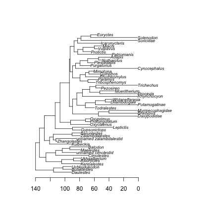

> You can have an even nicer looking tree if you use the `strap` package!


```r
if(!require(strap)) install.packages("strap")
strap::geoscalePhylo(BeckLee_tree, cex.tip = 0.7, cex.ts = 0.6)
```

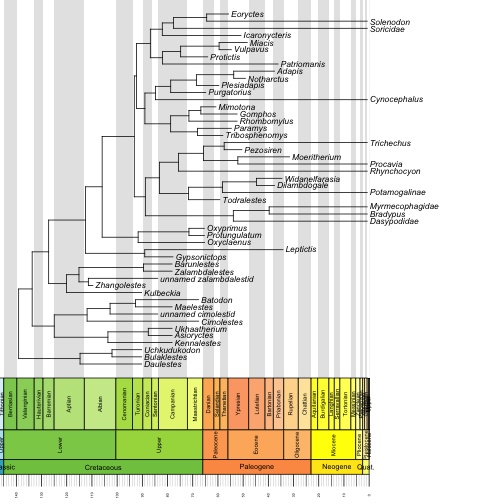

## A disparity-through-time analysis

### Splitting the morphospace through time

One of the crucial steps in disparity-through-time analysis is to split the full morphospace into smaller time subsets that contain the total number of morphologies at certain points in time (time-slicing) or during certain periods in time (time-binning).
Basically, the full morphospace represents the total number of morphologies across all time and will be greater than any of the time subsets of the morphospace.

The `dispRity` package provides a `chrono.subsets` function that allows users to split the morphospace into time slices (using `method = continuous`) or into time bins (using `method = discrete`).
In this example, we are going to split the morphospace into five equal time bins of 20 million years long from 100 million years ago to the present.
We will also provide to the function a table containing the first and last occurrences dates for some fossils to take into account that some fossils might occur in several of our different time bins.


```r
## Creating the vector of time bins ages
(time_bins <- rev(seq(from = 0, to = 100, by = 20)))
```

```
## [1] 100  80  60  40  20   0
```

```r
## Splitting the morphospace using the chrono.subsets function
(binned_morphospace <- chrono.subsets(data = BeckLee_mat50, tree = BeckLee_tree,
    method = "discrete", time = time_bins, inc.nodes = FALSE,
    FADLAD = BeckLee_ages))
```

```
##  ---- dispRity object ---- 
## 5 discrete time subsets for 50 elements:
##     100 - 80, 80 - 60, 60 - 40, 40 - 20, 20 - 0.
```

The output object is a `dispRity` object (see more about that [here](#The-guts-of-the-dispRity-package).
In brief, however, `dispRity` objects are lists of different elements (i.e. disparity results, morphospace time subsets, morphospace attributes, etc.) that display only a summary of the object when calling the object to avoiding filling the `R` console with superfluous output.


```r
## Printing the class of the object
class(binned_morphospace)
```

```
## [1] "dispRity"
```

```r
## Printing the content of the object
str(binned_morphospace)
```

```
## List of 3
##  $ matrix : num [1:50, 1:48] -0.532 -0.409 -0.692 -0.68 -0.739 ...
##   ..- attr(*, "dimnames")=List of 2
##   .. ..$ : chr [1:50] "Cimolestes" "Maelestes" "Batodon" "Bulaklestes" ...
##   .. ..$ : NULL
##  $ call   :List of 1
##   ..$ subsets: chr "discrete"
##  $ subsets:List of 5
##   ..$ 100 - 80:List of 1
##   .. ..$ elements: int [1:8, 1] 5 4 6 8 43 10 11 42
##   ..$ 80 - 60 :List of 1
##   .. ..$ elements: int [1:15, 1] 7 8 9 1 2 3 12 13 14 44 ...
##   ..$ 60 - 40 :List of 1
##   .. ..$ elements: int [1:13, 1] 41 49 24 25 26 27 28 21 22 19 ...
##   ..$ 40 - 20 :List of 1
##   .. ..$ elements: int [1:6, 1] 15 39 40 35 23 47
##   ..$ 20 - 0  :List of 1
##   .. ..$ elements: int [1:10, 1] 36 37 38 32 33 34 50 48 29 30
##  - attr(*, "class")= chr "dispRity"
```

```r
names(binned_morphospace)
```

```
## [1] "matrix"  "call"    "subsets"
```

```r
## Printing the object as a dispRity class
binned_morphospace
```

```
##  ---- dispRity object ---- 
## 5 discrete time subsets for 50 elements:
##     100 - 80, 80 - 60, 60 - 40, 40 - 20, 20 - 0.
```

> These objects will gradual.splitly contain more information when completing the following steps in the disparity-through-time analysis.

### Bootstrapping the data

Once we obtain our different time subsets, we can bootstrap and rarefy them (i.e. pseudo-replicating the data).
The bootstrapping allows us to make each subset more robust to outliers and the rarefaction allows us to compare subsets with the same number of taxa to remove sampling biases (i.e. more taxa in one subset than the others).
The `boot.matrix` function bootstraps the `dispRity` object and the `rarefaction` option within performs rarefaction.


```r
## Bootstrapping each time subset 100 times (default)
(boot_bin_morphospace <- boot.matrix(binned_morphospace))
```

```
##  ---- dispRity object ---- 
## 5 discrete time subsets for 50 elements with 48 dimensions:
##     100 - 80, 80 - 60, 60 - 40, 40 - 20, 20 - 0.
## Data was bootstrapped 100 times (method:"full").
```

```r
## Getting the minimum number of rows (i.e. taxa) in the time subsets
min(size.subsets(boot_bin_morphospace))
```

```
## [1] 6
```

```r
## Bootstrapping each time subset 100 times and rarefying them 
(rare_bin_morphospace <- boot.matrix(binned_morphospace, bootstraps = 100,
    rarefaction = 6))
```

```
##  ---- dispRity object ---- 
## 5 discrete time subsets for 50 elements with 48 dimensions:
##     100 - 80, 80 - 60, 60 - 40, 40 - 20, 20 - 0.
## Data was bootstrapped 100 times (method:"full") and rarefied to 6 elements.
```

### Calculating disparity

We can now calculate the disparity within each time subsets along with some confidence intervals generated by the pseudoreplication step above (bootstraps/rarefaction).
Disparity can be calculated in many ways and this package allows users to come up with their own disparity metrics.
For more details, please refer to the [`dispRity` metric section](#disparity-metrics).

In this example, we are going to calculate the spread of the data in each time subset by calculating disparity as the sum of the variance of each dimension of the morphospace in each time subset using the `dispRity` function.
Thus, in this example, disparity is defined by the multi-dimensional variance of each time subset (i.e. the spread of the taxa within the morphospace).
Note that this metric comes with a caveat (not solved here) since it ignores covariances among the dimensions of the morphospace.
We use this here because it is a standard metric used in disparity-through-time analysis [@Wills1994].


```r
## Calculating disparity for the bootstrapped data
(boot_disparity <- dispRity(boot_bin_morphospace, metric = c(sum, variances)))
```

```
##  ---- dispRity object ---- 
## 5 discrete time subsets for 50 elements with 48 dimensions:
##     100 - 80, 80 - 60, 60 - 40, 40 - 20, 20 - 0.
## Data was bootstrapped 100 times (method:"full").
## Disparity was calculated as: c(sum, variances).
```

```r
## Calculating disparity for the rarefied data
(rare_disparity <- dispRity(rare_bin_morphospace, metric = c(sum, variances)))
```

```
##  ---- dispRity object ---- 
## 5 discrete time subsets for 50 elements with 48 dimensions:
##     100 - 80, 80 - 60, 60 - 40, 40 - 20, 20 - 0.
## Data was bootstrapped 100 times (method:"full") and rarefied to 6 elements.
## Disparity was calculated as: c(sum, variances).
```

The `dispRity` function does not actually display the calculated disparity values but rather only the properties of the disparity object (size, subsets, metric, etc.).
To display the actual calculated scores, we need to summarise the disparity object using the S3 method `summary` that is applied to a `dispRity` object (see `?summary.dispRity` for more details).

As for any `R` package, you can refer to the help files for each individual function for more details.


```r
## Summarising the disparity results
summary(boot_disparity)
```

```
##    subsets  n   obs bs.median  2.5%   25%   75% 97.5%
## 1 100 - 80  8 1.675     1.488 1.087 1.389 1.568 1.648
## 2  80 - 60 15 1.782     1.679 1.538 1.631 1.728 1.792
## 3  60 - 40 13 1.913     1.772 1.607 1.734 1.826 1.886
## 4  40 - 20  6 2.022     1.707 1.212 1.537 1.822 1.942
## 5   20 - 0 10 1.971     1.794 1.598 1.716 1.842 1.890
```

```r
summary(rare_disparity)
```

```
##    subsets  n   obs bs.median  2.5%   25%   75% 97.5%
## 1 100 - 80  8 1.675     1.484 1.194 1.400 1.547 1.636
## 2 100 - 80  6    NA     1.477 0.993 1.361 1.569 1.698
## 3  80 - 60 15 1.782     1.674 1.517 1.600 1.725 1.793
## 4  80 - 60  6    NA     1.655 1.299 1.532 1.754 1.882
## 5  60 - 40 13 1.913     1.767 1.601 1.714 1.829 1.861
## 6  60 - 40  6    NA     1.787 1.314 1.672 1.879 1.984
## 7  40 - 20  6 2.022     1.736 1.281 1.603 1.822 1.948
## 8   20 - 0 10 1.971     1.807 1.595 1.729 1.856 1.917
## 9   20 - 0  6    NA     1.790 1.435 1.718 1.873 1.995
```
> The summary.dispRity function comes with many options on which values to calculate (central tendency and quantiles) and on how many digits to display. Refer to the function's manual for more details.

### Plotting the results

It is sometimes easier to visualise the results in a plot than in a table.
For that we can use the `plot` S3 function to plot the `dispRity` objects (see `?plot.dispRity` for more details).


```r
## Graphical options
quartz(width = 10, height = 5) ; par(mfrow = (c(1,2)), bty = "n")

## Plotting the bootstrapped and rarefied results
plot(boot_disparity, type = "continuous", main = "bootstrapped results")
plot(rare_disparity, type = "continuous", main = "rarefied results")
```

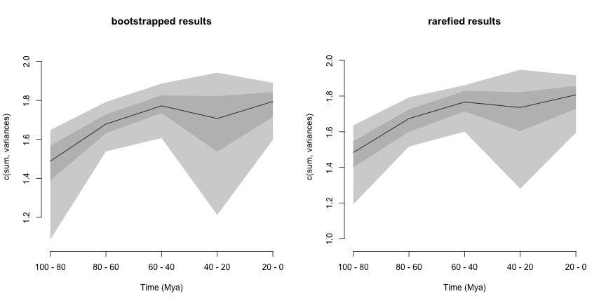

Testing differences
-------------------

Finally, to draw some valid conclusions from these results, we can apply some statistical tests.
We can test, for example, if mammalian disparity changed significantly through time over the last 100 million years.
To do so, we can compare the means of each time-bin in a sequential manner to see whether the disparity in bin *n* is equal to the disparity in bin *n+1*, and whether this is in turn equal to the disparity in bin *n+2*, etc.
Because our data is temporally autocorrelated (i.e. what happens in bin *n+1* depends on what happened in bin *n*) and pseudoreplicated (i.e. each bootstrap draw creates non-independent time subsets because they are all based on the same time subsets), we apply a non-parametric mean comparison: the `wilcox.test`.
Also, we need to apply a p-value correction (e.g. Bonferroni correction) to correct for multiple testing (see `?p.adjust` for more details).


```r
## Testing the differences between bins in the bootstrapped dataset.
test.dispRity(boot_disparity, test = wilcox.test, comparison = "sequential",
    correction = "bonferroni")
```

```
## [[1]]
##                    statistic: W
## 100 - 80 : 80 - 60          471
## 80 - 60 : 60 - 40          1562
## 60 - 40 : 40 - 20          6250
## 40 - 20 : 20 - 0           3725
## 
## [[2]]
##                         p.value
## 100 - 80 : 80 - 60 7.427563e-28
## 80 - 60 : 60 - 40  1.798899e-16
## 60 - 40 : 40 - 20  9.061511e-03
## 40 - 20 : 20 - 0   7.379715e-03
```

```r
## Testing the differences between bins in the rarefied dataset.
test.dispRity(rare_disparity, test = wilcox.test, comparison = "sequential",
    correction = "bonferroni")
```

```
## [[1]]
##                    statistic: W
## 100 - 80 : 80 - 60          662
## 80 - 60 : 60 - 40          1814
## 60 - 40 : 40 - 20          5752
## 40 - 20 : 20 - 0           3621
## 
## [[2]]
##                         p.value
## 100 - 80 : 80 - 60 1.214988e-25
## 80 - 60 : 60 - 40  2.823697e-14
## 60 - 40 : 40 - 20  2.653018e-01
## 40 - 20 : 20 - 0   3.026079e-03
```

Here our results show significant changes in disparity through time between all time bins (all p-values < 0.05).
However, when looking at the rarefied results, there is no significant difference between the time bins in the Palaeogene (60-40 to 40-20 Mya), suggesting that the differences detected in the first test might just be due to the differences in number of taxa sampled (13 or 6 taxa) in each time bin.

<!--chapter:end:06_palaeo-demo.Rmd-->

---
title: "dispRity ecology demo"
author: "Thomas Guillerme"
date: "2019-03-06"
output: rmarkdown::html_vignette
bibliography: [../References.bib, ../packages.bib]
bst: sysbio.bst
vignette: >
  %\VignetteIndexEntry{dispRity ecology demo}
  %\VignetteEngine{knitr::rmarkdown}
  \usepackage[utf8]{inputenc}
---


# Ecology demo

This is an example of typical disparity analysis that can be performed in ecology.


## Data
For this example, we will use the famous `iris` inbuilt data set


```r
data(iris)
```

This data contains petal and sepal length for 150 individual plants sorted into three species.


```r
## Separating the species
species <- iris[,5]
## Which species?
unique(species)
```

```
## [1] setosa     versicolor virginica 
## Levels: setosa versicolor virginica
```

```r
## Separating the petal/sepal length
measurements <- iris[,1:4]
head(measurements)
```

```
##   Sepal.Length Sepal.Width Petal.Length Petal.Width
## 1          5.1         3.5          1.4         0.2
## 2          4.9         3.0          1.4         0.2
## 3          4.7         3.2          1.3         0.2
## 4          4.6         3.1          1.5         0.2
## 5          5.0         3.6          1.4         0.2
## 6          5.4         3.9          1.7         0.4
```

We can then ordinate the data using a PCA (`prcomp` function) thus defining our four dimensional space as the poetically named petal-space. 


```r
## Ordinating the data
ordination <- prcomp(measurements)

## The petal-space
petal_space <- ordination$x

## Adding the elements names to the petal-space (the individuals IDs)
rownames(petal_space) <- 1:nrow(petal_space)
```

## Classic analysis
A classical way to represent this ordinated data would be to use two dimensional plots to look at how the different species are distributed in the petal-space. 


```r
## Measuring the variance on each axis
variances <- apply(petal_space, 2, var)
variances <- variances/sum(variances)

## Graphical option
par(bty = "n")

## A classic 2D ordination plot
plot(petal_space[, 1], petal_space[, 2], col = species,
    xlab = paste0("PC 1 (", round(variances[1], 2), ")"),
    ylab = paste0("PC 2 (", round(variances[2], 2), ")"))
```

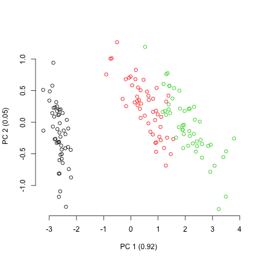

This shows the distribution of the different species in the petal-space along the two first axis of variation.
This is a pretty standard way to visualise the multidimensional space and further analysis might be necessary to test wether the groups are different such as a linear discriminant analysis (LDA).
However, in this case we are ignoring the two other dimensions of the ordination!
If we look at the two other axis we see a totally different result:


```r
## Plotting the two second axis of the petal-space
plot(petal_space[, 3], petal_space[, 4], col = species,
    xlab = paste0("PC 3 (", round(variances[3], 2), ")"),
    ylab = paste0("PC 4 (", round(variances[4], 2), ")"))
```

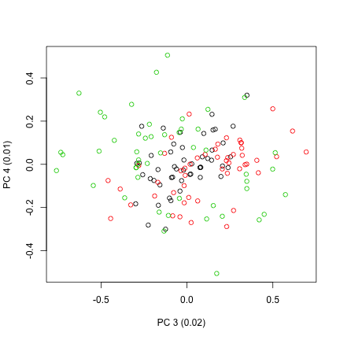

Additionally, these two represented dimensions do not represent a biological reality *per se*; i.e. the values on the first dimension do not represent a continuous trait (e.g. petal length), instead they just represent the ordinations of correlations between the data and some factors.

Therefore, we might want to approach this problem without getting stuck in only two dimensions and consider the whole dataset as a *n*-dimensional object.

## A multidimensional approach with `dispRity`

The first step is to create different subsets that represent subsets of the ordinated space (i.e. sub-regions within the *n*-dimensional object).
Each of these subsets will contain only the individuals of a specific species.


```r
## Creating the table that contain the elements and their attributes
petal_subsets <- custom.subsets(petal_space, group = list(
                                "setosa" = which(species == "setosa"),
                                "versicolor" = which(species == "versicolor"),
                                "virginica" = which(species == "virginica")))

## Visualising the dispRity object content
petal_subsets
```

```
##  ---- dispRity object ---- 
## 3 customised subsets for 150 elements:
##     setosa, versicolor, virginica.
```

This created a `dispRity` object (more about that [here](#guts)) with three subsets corresponding to each subspecies.

### Bootstrapping the data
We can the bootstrap the subsets to be able test the robustness of the measured disparity to outliers.
We can do that using the default options of `boot.matrix` (more about that [here](#bootstraps-and-rarefactions)):


```r
## Bootstrapping the data
(petal_bootstrapped <- boot.matrix(petal_subsets))
```

```
##  ---- dispRity object ---- 
## 3 customised subsets for 150 elements with 4 dimensions:
##     setosa, versicolor, virginica.
## Data was bootstrapped 100 times (method:"full").
```

### Calculating disparity

Disparity can be calculated in many ways, therefore the `dispRity` function allows users to define their own measure of disparity.
For more details on measuring disparity, see the [dispRity metrics section](#disparity-metrics).

In this example, we are going to define disparity as the median distance between the different individuals and the centroid of the ordinated space.
High values of disparity will indicate a generally high spread of points from this centroid (i.e. on average, the individuals are far apart in the ordinated space).
We can define the metrics easily in the `dispRity` function by feeding them to the `metric` argument.
Here we are going to feed the functions `stats::median` and `dispRity::centroids` which calculates distances between elements and their centroid.


```r
## Calculating disparity as the median distance between each elements and
## the centroid of the petal-space
(petal_disparity <- dispRity(petal_bootstrapped, metric = c(median, centroids)))
```

```
##  ---- dispRity object ---- 
## 3 customised subsets for 150 elements with 4 dimensions:
##     setosa, versicolor, virginica.
## Data was bootstrapped 100 times (method:"full").
## Disparity was calculated as: c(median, centroids).
```

### Summarising the results (plot)
Similarly to the `custom.subsets` and `boot.matrix` function, `dispRity` displays a `dispRity` object.
But we are definitely more interested in actually look at the calculated values.

First we can summarise the data in a table by simply using `summary`:


```r
## Displaying the summary of the calculated disparity
summary(petal_disparity)
```

```
##      subsets  n   obs bs.median  2.5%   25%   75% 97.5%
## 1     setosa 50 0.421     0.419 0.342 0.401 0.445 0.503
## 2 versicolor 50 0.693     0.657 0.530 0.622 0.692 0.733
## 3  virginica 50 0.785     0.745 0.577 0.690 0.797 0.880
```

We can also plot the results in a similar way:


```r
## Graphical options
par(bty = "n")

## Plotting the disparity in the petal_space
plot(petal_disparity)
```

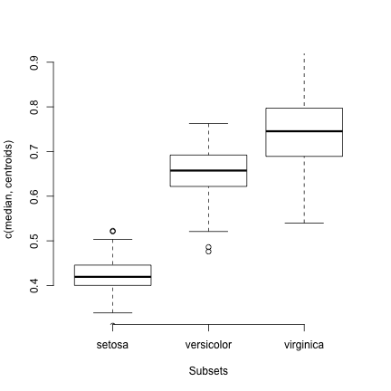

Now contrary to simply plotting the two first axis of the PCA where we saw that the species have a different position in the two first petal-space, we can now also see that they occupy this space clearly differently!


### Testing hypothesis

Finally we can test our hypothesis that we guessed from the disparity plot (that some groups occupy different volume of the petal-space) by using the `test.dispRity` option.


```r
## Running a PERMANOVA
test.dispRity(petal_disparity, test = adonis.dispRity)
```

```
## Warning in test.dispRity(petal_disparity, test = adonis.dispRity): adonis.dispRity test will be applied to the data matrix, not to the calculated disparity.
## See ?adonis.dispRity for more details.
```

```
## Warning in adonis.dispRity(data, ...): The input data for adonis.dispRity was not a distance matrix.
## The results are thus based on the distance matrix for the input data (i.e. dist(data$matrix)).
## Make sure that this is the desired methodological approach!
```

```
## 
## Call:
## vegan::adonis(formula = dist(matrix) ~ group, data = data, method = "euclidean") 
## 
## Permutation: free
## Number of permutations: 999
## 
## Terms added sequentially (first to last)
## 
##            Df SumsOfSqs MeanSqs F.Model      R2 Pr(>F)    
## group       2    592.07 296.037  487.33 0.86894  0.001 ***
## Residuals 147     89.30   0.607         0.13106           
## Total     149    681.37                 1.00000           
## ---
## Signif. codes:  0 '***' 0.001 '**' 0.01 '*' 0.05 '.' 0.1 ' ' 1
```

```r
## Post-hoc testing of the differences between species (corrected for multiple tests)
test.dispRity(petal_disparity, test = t.test, correction = "bonferroni")
```

```
## [[1]]
##                        statistic: t
## setosa : versicolor      -33.714480
## setosa : virginica       -34.257797
## versicolor : virginica    -8.595829
## 
## [[2]]
##                        parameter: df
## setosa : versicolor         189.0217
## setosa : virginica          150.1371
## versicolor : virginica      171.2387
## 
## [[3]]
##                             p.value
## setosa : versicolor    2.107278e-81
## setosa : virginica     2.252270e-72
## versicolor : virginica 1.506037e-14
```

We can now see that there is a significant difference in petal-space occupancy between all species of iris.


#### Setting up a multidimensional null-hypothesis

One other series of test can be done on the shape of the petal-space.
Using a MCMC permutation test we can simulate a petal-space with specific properties and see if our observed petal-space matches these properties (similarly to @diaz2016global):


```r
## Testing against a uniform distribution
disparity_uniform <- null.test(petal_disparity, replicates = 200,
    null.distrib = runif, scale = FALSE)
plot(disparity_uniform)
```

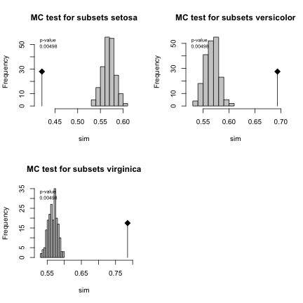


```r
## Testing against a normal distribution
disparity_normal <- null.test(petal_disparity, replicates = 200,
    null.distrib = rnorm, scale = TRUE)
plot(disparity_normal)
```

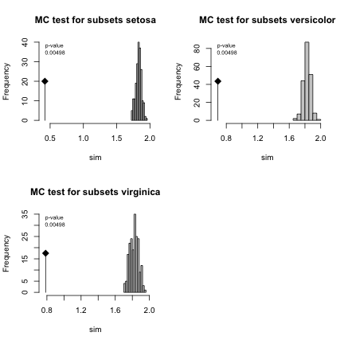

In both cases we can see that our petal-space is not entirely normal or uniform.
This is expected because of the simplicity of these parameters.

<!--chapter:end:07_ecology-demo.Rmd-->

---
title: "Future directions and references"
author: "Thomas Guillerme"
date: "2019-03-06"
output: rmarkdown::html_vignette
bibliography: [../References.bib, ../packages.bib]
bst: sysbio.bst
vignette: >
  %\VignetteIndexEntry{future directions}
  %\VignetteEngine{knitr::rmarkdown}
  \usepackage[utf8]{inputenc}
---


# Developing `dispRity`

Everyone is more than welcome to help developing this package, whether it is through developing functions (metrics, tests, plots, etc...), the manual (more examples, typos, etc...) or completely new functionalities!


## More functions

## More manuals


<!-- 
* Beck, R. M., & Lee, M. S. (2014). Ancient dates or accelerated rates? Morphological clocks and the antiquity of placental mammals. Proceedings of the Royal Society of London B: Biological Sciences, 281(1793), 20141278.
* Cooper, N., & Guillerme, T. (in prep.). Coming soonish!.
* Diaz, S., Kattge, J., Cornelissen, J.H., Wright, I.J., Lavorel, S., Dray, S., Reu, B., Kleyer, M., Wirth, C., Prentice, I.C. and Garnier, E. (2016). The global spectrum of plant form and function. Nature, 529(7585), 167.
* Donohue, I., Petchey, O.L., Montoya, J.M., Jackson, A.L., McNally, L., Viana, M., Healy, K., Lurgi, M., O'Connor, N.E. and Emmerson, M.C, (2013). On the dimensionality of ecological stability. Ecology letters, 16(4), 421-429.
* Wills, M. A., Briggs, D. E., & Fortey, R. A. (1994). Disparity as an evolutionary index: a comparison of Cambrian and Recent arthropods. Paleobiology, 20(2), 93-130. -->

<!--chapter:end:08_future_directions.Rmd-->


<!--chapter:end:09_references.Rmd-->

